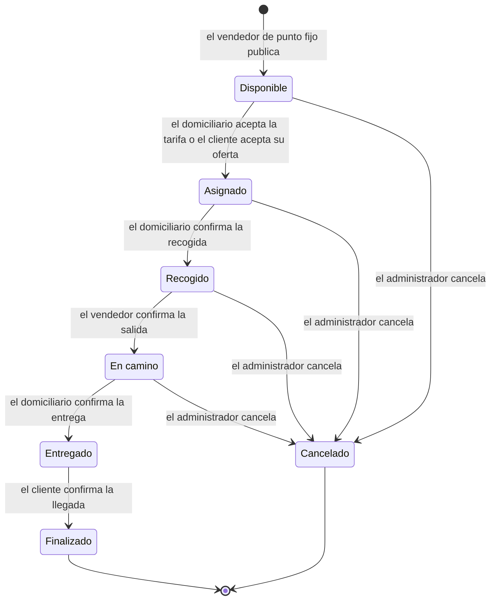

# PLANTILLA DE PROYECTO: EXPERIENCIA FINAL DE DISEÑO

Ñapa - Plataforma para vendedores informales y pequeños comerciantes.

## INFORMACIÓN GENERAL

- **Programa:** Ingeniería de Sistemas (Universidad del Magdalena)
- **Curso:** Proyecto Culminante de Diseño
- **Código del curso:** 9011655
- **Créditos:** 4
- **Periodo académico:** 2026-2
- **Semestre:** 9

## 1. IDENTIFICACIÓN DEL PROYECTO

- **Título del proyecto:** Ñapa - Plataforma de comercio de cercanía y domicilios para vendedores informales

**Tipo de proyecto:**
- ✅ Productivo - impacta directamente los ingresos diarios de vendedores informales
- ✅ Innovación / transferencia tecnológica - introduce publicación digital, pedidos anticipados y logística de domicilios a un sector que hoy opera de forma verbal/WhatsApp
- ☐ Investigación aplicada
- ☐ Intervención agroambiental

- **Contexto real del problema:** El problema se presenta en el comercio informal de Santa Marta: vendedores ambulantes, de carretilla, de alimentos preparados y pequeños negocios
familiares que operan en calles, barrios, parques y zonas turísticas, ya sea desplazándose (vendedores ambulantes) o desde un puesto o local fijo (vendedores de punto fijo), y sin un canal digital de venta. Su alcance depende exclusivamente del tránsito peatonal, no pueden
anunciar con anticipación qué tienen disponible ni recibir pedidos antes de salir a vender, y una parte de su mercancía especialmente productos perecederos como frutas, pescado
y alimentos preparados se pierde al final del día por falta de un mecanismo para conectar oferta y demanda antes de que el producto se dañe. El detalle completo del problema,
su formulación técnica y la evidencia recogida en campo está documentado en [`investigacion/problema.md`](../investigacion/problema.md).

- **Duración del proyecto:** 4 meses

**Trabajo:**
- ☐ Individual
- ✅ En equipo
- **Integrantes (5):** Iván Marchena, Eduardo Vergara, Stiven Navarro, Camilo Jiménez, Rafael Acuña. 

## 2. DESCRIPCIÓN DEL PROBLEMA DE INGENIERÍA

**Situación problemática identificada:** En Santa Marta, una parte importante de la actividad comercial la constituyen vendedores informales y pequeños comerciantes (carretilleros, vendedores ambulantes,
de alimentos preparados, negocios familiares) que dependen de la venta diaria de sus productos para sostener a sus familias. Estos vendedores no pueden dar visibilidad a su oferta más allá del punto físico
donde se ubican, no tienen un canal estructurado para recibir pedidos anticipados, y dependen de mecanismos informales (voz a voz, WhatsApp, llamadas, carteles) que no permiten gestionar de forma ordenada la oferta,
los pedidos ni las entregas. Esta situación es crítica para quienes venden productos perecederos (frutas, pescado, alimentos preparados), donde lo no vendido en el día se convierte en pérdida económica directa.

Por su parte, los consumidores cercanos no tienen forma de saber qué vendedores están cerca, qué productos ofrecen, a qué precio y en qué cantidad, lo que limita sus posibilidades de compra y mantiene al vendedor
dependiente exclusivamente del tránsito peatonal.

**Necesidad o demanda del entorno:** Las 5 entrevistas semiestructuradas realizadas ([`investigacion/entrevistas.md`](../investigacion/entrevistas.md)) confirman de forma consistente: 
(1) incertidumbre de demanda al comprar/preparar mercancía, (2) alto riesgo económico en productos perecederos, (3) existencia real de pedidos anticipados manejados informalmente por WhatsApp/llamadas,
y (4) el domicilio como oportunidad no resuelta — los vendedores no pueden abandonar su punto de venta para entregar personalmente.

**Usuarios o beneficiarios:**
- **Vendedor ambulante:** vendedor de carretilla, de termo o de puesto móvil que se desplaza para vender. Atiende pedidos de *entrega directa* (va hasta donde está el cliente) y *reservas* para el día siguiente con entrega al cliente.
- **Vendedor de punto fijo:** vendedor de alimentos preparados, pequeño negocio familiar o comerciante con establecimiento. Atiende *reservas* que el cliente retira en el punto fijo y ofrece *domicilios* mediante domiciliarios.
- **Cliente:** persona cercana que quiere descubrir y comprar productos sin depender de coincidir físicamente con el vendedor.
- **Domiciliario:** persona que genera ingresos adicionales realizando entregas para vendedores de punto fijo que no pueden abandonar su punto de venta, con la posibilidad de ofertar el precio de cada servicio.

**Justificación técnica y social del proyecto:** Técnicamente, el problema es resoluble con un modelo de publicación de disponibilidad en tiempo real, gestión de pedidos e inventario, y un mercado de domicilios
bajo demanda sin requerir que el vendedor adopte herramientas complejas (mapa de empatía, Dolor 5: "Publicar → recibir pedido → confirmar → vender"). Socialmente, la solución impacta directamente los ingresos
de un sector vulnerable de la economía informal santamartense, reduciendo el desperdicio de productos perecederos y ampliando el mercado del vendedor más allá de su ubicación física.

## 3. RESTRICCIONES Y CONDICIONANTES DEL DISEÑO

- ✅ Técnicas
- ✅ Económicas
- ☐ Ambientales
- ✅ Sociales y culturales
- ✅ Normativas y legales
- ☐ Salud y seguridad
- ✅ Éticas

**Descripción detallada de la incorporación de restricciones:**

- **Técnicas:** los vendedores operan en la calle durante toda su jornada, sin garantía de conexión estable a internet ni de datos móviles constantes, y muchos usan equipos de gama baja con almacenamiento
y capacidad de procesamiento limitados. Esto condiciona el diseño para que funcionalidades críticas como publicar disponibilidad o consultar pedidos toleren conectividad intermitente y sincronicen cuando la 
señal se recupere, en vez de requerir una conexión permanente (RNF28 y RNF31).
- **Económicas:** los vendedores informales no tienen presupuesto para tecnología costosa ni comisiones altas por transacción. Esto llevó a decidir que el sistema se desligue por completo de transferencias y pasarelas de pago: 
el pago es exclusivamente en efectivo (RNF29) y la plataforma solo registra la confirmación de cada cobro, dejando que el dinero se mueva fuera de la aplicación.
- **Sociales y culturales:** las entrevistas mostraron vendedores mayores con temor a herramientas complicadas ("Yo no tengo tiempo para estar aprendiendo cosas difíciles" - Sergio, entrevista #3). 
El diseño de casos de uso privilegia flujos cortos (publicar → recibir pedido → confirmar → vender) y evita catálogos o formularios extensos.
- **Normativas y legales:** el manejo de ubicación (para calcular cercanía) y de datos personales (nombre, teléfono, foto) debe cumplir la Ley 1581 de Protección de Datos Personales. 
Esto se refleja en RNF04 (Privacidad) y en que el sistema restringe el acceso a datos personales únicamente a usuarios autorizados según su rol (RNF03).
- **Éticas:** el sistema de calificación bidireccional (Cliente ↔ Vendedor ↔ Domiciliario) introduce un riesgo real de sesgo  por ejemplo, calificaciones usadas como represalia,
o domiciliarios calificados injustamente por demoras fuera de su control (tráfico, clima). Por eso se incluyeron casos de uso de moderación (Eliminar comentario, Editar comentario) con intervención del Administrador.

## 4. ANÁLISIS Y ESPECIFICACIÓN DE REQUERIMIENTOS

Este capítulo resume el análisis realizado hasta el momento: actores, casos de uso, requerimientos funcionales y no funcionales, y las especificaciones por requerimiento. El detalle completo vive en los archivos del repositorio, que son la fuente de verdad:
[`casos de uso/`](../casos%20de%20uso/) · [`investigacion/HistoriasDeUsuario/historias_de_usuario.md`](../investigacion/HistoriasDeUsuario/historias_de_usuario.md) · [`requerimientos/funcionales.md`](../requerimientos/funcionales.md) · [`requerimientos/no-funcionales.md`](../requerimientos/no-funcionales.md) · [`requerimientos/trazabilidad.md`](../requerimientos/trazabilidad.md) · [`specs/`](../specs/).

**Criterio de modelado.** Un caso de uso corresponde a una pantalla o acción (un botón o una vista) que el usuario final realiza en la aplicación; no es un CRUD de una entidad. Los filtros, ordenamientos y validaciones (por ejemplo, filtrar un listado por fecha) son funcionalidad del caso de uso y se detallan en su especificación, no como casos de uso aparte.

### 4.1 Actores y roles

El vendedor no es un único rol: los vendedores ambulantes y los de punto fijo tienen flujos distintos, por lo que el actor *Vendedor* es abstracto y se especializa en dos roles que el usuario elige al crear su cuenta.

| Actor | Descripción |
|---|---|
| **Usuario** | Actor base con las funcionalidades comunes (cuenta y notificaciones). |
| **Cliente** | Descubre emprendimientos cercanos y hace pedidos en las modalidades de entrega directa, reserva o domicilio. |
| **Vendedor** *(abstracto)* | Administra su emprendimiento y sus productos y atiende pedidos (listar, ver detalle, aceptar o rechazar). |
| **Vendedor ambulante** | Se desplaza para vender. Atiende entregas directas y reservas con entrega al cliente. |
| **Vendedor de punto fijo** | Vende desde un puesto o local fijo. Atiende reservas con retiro en el punto y ofrece domicilios. |
| **Domiciliario** | Lleva un pedido del punto fijo al cliente; ve la ganancia de cada domicilio, puede archivarlo u ofertar otro precio. |
| **Administrador** | Supervisa usuarios, domicilios, pagos, comentarios y reportes, y define la tarifa mínima de domicilio. |

### 4.2 Modalidades de entrega y flujos por tipo de vendedor

| Modalidad | Vendedor ambulante | Vendedor de punto fijo | Quién lleva o entrega el pedido |
|---|:---:|:---:|---|
| Entrega directa | ✅ | — | El propio vendedor ambulante va hasta la ubicación del cliente. |
| Reserva (para el día siguiente) | ✅ | ✅ | Ambulante: el vendedor lo lleva al cliente. Punto fijo: el cliente lo retira en el punto fijo. |
| Domicilio | — | ✅ | Un domiciliario lo lleva del punto fijo (A) a la ubicación del cliente (B). |

**Entrega directa (vendedor ambulante).** El cliente realiza el pedido (RF-45) → el vendedor ambulante recibe la notificación (RF-38) y lo acepta o rechaza (RF-53) → consulta la ubicación del cliente en el mapa (RF-35) → inicia la entrega (RF-36) → confirma la entrega y el cobro en efectivo (RF-37, RF-42).

**Reserva con vendedor ambulante.** El cliente consulta la disponibilidad prevista para el día siguiente (RF-46) y reserva (RF-45) → el vendedor decide si la cumple apoyándose en la predicción de demanda (RF-59) y la acepta o rechaza (RF-53) → el día programado sigue el mismo flujo de la entrega directa (RF-35, RF-36, RF-37).

**Reserva con vendedor de punto fijo.** El cliente consulta la disponibilidad prevista (RF-46) y reserva (RF-45) → el vendedor la acepta (RF-53) → el cliente consulta la ubicación del punto (RF-63) → el vendedor la marca como lista (RF-64) → el cliente la retira y el vendedor confirma el retiro y el cobro (RF-65, RF-42).

**Domicilio (vendedor de punto fijo).** El cliente pide el domicilio indicando su ubicación (RF-45) → el vendedor acepta el pedido (RF-53) y publica el domicilio (RF-14), que **no puede editarse** → los domiciliarios ven los disponibles con su ganancia (RF-16), consultan la información (RF-18) y pueden archivarlos (RF-17), aceptarlos con la tarifa publicada (RF-19) u ofertar otro precio (RF-20) → el cliente acepta o rechaza las ofertas (RF-21) → el domiciliario ve la ruta en el mapa (RF-22), confirma que recogió el pedido y el vendedor confirma que va en camino (RF-23) → el domiciliario confirma la entrega (RF-24) y el cliente confirma la llegada (RF-25) → el domiciliario registra su cobro (RF-43). El cliente puede seguir la trazabilidad en todo momento (RF-26).

**Ciclo de vida de un domicilio:**

### 4.3 Casos de uso

Se elaboró un diagrama de nivel 0 y un diagrama por módulo (PlantUML). Los módulos específicos por tipo de vendedor son *Gestionar entregas del vendedor ambulante* y *Gestionar reservas en punto fijo*; *Gestionar domicilios* concentra los flujos de punto fijo, domiciliario y cliente.

| Módulo | Diagrama | Actores | Casos de uso |
|---|---|---|---|
| Nivel 0 | [`nivel0.puml`](../casos%20de%20uso/nivel0.puml) | Todos | 12 módulos |
| Gestionar comentarios y calificaciones | [`gestionar_comentarios_calificaciones.puml`](../casos%20de%20uso/gestionar_comentarios_calificaciones.puml) | Cliente, Vendedor de punto fijo, Domiciliario, Vendedor, Administrador, Usuario | Calificar y comentar emprendimiento; Calificar y comentar producto; Calificar y comentar domiciliario; Calificar y comentar cliente; Consultar calificaciones y comentarios de un emprendimiento; Consultar calificaciones y comentarios de un producto; Consultar calificaciones y comentarios de un domiciliario; Consultar calificaciones y comentarios de un cliente; Consultar calificaciones y comentarios (emprendimiento, producto, domiciliario o cliente); Eliminar comentario; Editar comentario |
| Gestionar cuenta | [`gestionar_cuenta.puml`](../casos%20de%20uso/gestionar_cuenta.puml) | Usuario, Administrador | Crear una cuenta; Editar mi cuenta; Cambiar contraseña; Iniciar sesión en mi cuenta; Eliminar mi cuenta |
| Gestionar domicilios | [`gestionar_domicilios.puml`](../casos%20de%20uso/gestionar_domicilios.puml) | Vendedor de punto fijo, Domiciliario, Cliente, Administrador | Publicar domicilio; Listar domicilios; Consultar estado del domicilio; Consultar información del domiciliario; Confirmar salida del domiciliario; Listar domicilios disponibles; Archivar domicilio; Consultar domicilios archivados; Consultar información del domicilio; Aceptar domicilio; Ofertar precio del domicilio; Consultar ofertas de precio; Aceptar oferta de precio; Rechazar oferta de precio; Consultar ruta en el mapa; Confirmar recogida del pedido; Confirmar entrega del pedido; Consultar trazabilidad del domicilio; Confirmar llegada del pedido; Consultar domicilios; Cancelar domicilio |
| Gestionar emprendimientos | [`gestionar_emprendimientos.puml`](../casos%20de%20uso/gestionar_emprendimientos.puml) | Vendedor, Cliente | Crear emprendimiento; Editar emprendimiento; Eliminar emprendimiento; Listar emprendimientos; Consultar emprendimiento; Listar productos de un emprendimiento; Ver información del vendedor |
| Gestionar entregas del vendedor ambulante | [`gestionar_entrega_ambulante.puml`](../casos%20de%20uso/gestionar_entrega_ambulante.puml) | Vendedor ambulante | Consultar ubicación de entrega; Iniciar entrega; Confirmar entrega directa |
| Gestionar notificaciones | [`gestionar_notificaciones.puml`](../casos%20de%20uso/gestionar_notificaciones.puml) | Usuario | Consultar notificaciones; Configurar preferencias de notificación |
| Gestionar pagos | [`gestionar_pagos.puml`](../casos%20de%20uso/gestionar_pagos.puml) | Cliente, Vendedor, Domiciliario, Administrador | Consultar historial de pagos; Confirmar pago del pedido; Confirmar pago del domicilio; Configurar tarifa mínima del domicilio |
| Gestionar pedidos | [`gestionar_pedidos.puml`](../casos%20de%20uso/gestionar_pedidos.puml) | Cliente, Vendedor | Seleccionar productos; Seleccionar modalidad de entrega; Indicar ubicación de entrega; Consultar disponibilidad prevista; Realizar pedido; Listar mis pedidos; Consultar estado del pedido; Contactar vendedor o domiciliario; Listar pedidos recibidos; Consultar detalle del pedido; Ver información del cliente; Aceptar pedido; Rechazar pedido |
| Gestionar productos | [`gestionar_productos.puml`](../casos%20de%20uso/gestionar_productos.puml) | Vendedor | Añadir producto; Listar productos; Editar producto; Actualizar cantidad producto; Eliminar producto; Consultar predicción de demanda |
| Gestionar reportes | [`gestionar_reporte.puml`](../casos%20de%20uso/gestionar_reporte.puml) | Cliente, Vendedor, Domiciliario, Administrador | Reportar problema; Consultar reportes; Resolver reporte |
| Gestionar reservas en punto fijo | [`gestionar_reservas_punto_fijo.puml`](../casos%20de%20uso/gestionar_reservas_punto_fijo.puml) | Cliente, Vendedor de punto fijo | Consultar ubicación del punto de recogida; Marcar reserva como lista para recoger; Confirmar retiro de la reserva |
| Gestionar usuarios | [`gestionar_usuarios.puml`](../casos%20de%20uso/gestionar_usuarios.puml) | Administrador | Consultar un usuario; Editar un usuario; Eliminar un usuario; Listar todos los usuarios |

### 4.4 Requerimientos funcionales

Se definieron **69 requerimientos funcionales** derivados de **102 historias de usuario**, organizados en 12 módulos. La prioridad corresponde a la mayor prioridad entre las historias de su especificación (P1 = núcleo del flujo, P2 = importante, P3 = complementario).

| RF | Requerimiento | Actores | Prioridad | Especificación |
|---|---|---|:---:|---|
| | **Gestionar comentarios y calificaciones** | | | |
| RF-01 | Calificar y comentar entidades | Cliente, Vendedor de punto fijo, Domiciliario, Vendedor | P1 | [RF-01](../specs/RF-01-calificar-y-comentar-entidades.md) |
| RF-02 | Consultar calificaciones y comentarios | Cliente, Vendedor, Vendedor de punto fijo, Domiciliario | P1 | [RF-02](../specs/RF-02-consultar-calificaciones-y-comentarios.md) |
| RF-03 | Supervisión de calificaciones y comentarios | Administrador | P2 | [RF-03](../specs/RF-03-supervision-de-calificaciones-y-comentarios.md) |
| RF-04 | Edición de comentarios propios | Usuario | P2 | [RF-04](../specs/RF-04-edicion-de-comentarios-propios.md) |
| RF-05 | Eliminación de comentarios propios | Usuario | P2 | [RF-05](../specs/RF-05-eliminacion-de-comentarios-propios.md) |
| RF-06 | Moderación de comentarios | Administrador | P1 | [RF-06](../specs/RF-06-moderacion-de-comentarios.md) |
| | **Gestionar cuenta** | | | |
| RF-07 | Registro de cuenta | Usuario | P1 | [RF-07](../specs/RF-07-registro-de-cuenta.md) |
| RF-08 | Edición de datos de cuenta | Usuario | P2 | [RF-08](../specs/RF-08-edicion-de-datos-de-cuenta.md) |
| RF-09 | Cambio de contraseña | Usuario, Administrador | P1 | [RF-09](../specs/RF-09-cambio-de-contrasena.md) |
| RF-10 | Inicio de sesión | Usuario, Administrador | P1 | [RF-10](../specs/RF-10-inicio-de-sesion.md) |
| RF-11 | Eliminación de cuenta | Usuario | P2 | [RF-11](../specs/RF-11-eliminacion-de-cuenta.md) |
| | **Gestionar domicilios** | | | |
| RF-12 | Consulta de domicilios por administrador | Administrador | P3 | [RF-12](../specs/RF-12-consulta-de-domicilios-por-administrador.md) |
| RF-13 | Cancelación de domicilio por administrador | Administrador | P3 | [RF-13](../specs/RF-13-cancelacion-de-domicilio-por-administrador.md) |
| RF-14 | Publicación de domicilio | Vendedor de punto fijo | P1 | [RF-14](../specs/RF-14-publicacion-de-domicilio.md) |
| RF-15 | Listado de domicilios del vendedor | Vendedor de punto fijo | P2 | [RF-15](../specs/RF-15-listado-de-domicilios-del-vendedor.md) |
| RF-16 | Consulta de domicilios disponibles | Domiciliario | P1 | [RF-16](../specs/RF-16-consulta-de-domicilios-disponibles.md) |
| RF-17 | Archivado de domicilios | Domiciliario | P2 | [RF-17](../specs/RF-17-archivado-de-domicilios.md) |
| RF-18 | Consulta de información del domicilio por el domiciliario | Domiciliario | P1 | [RF-18](../specs/RF-18-consulta-de-informacion-del-domicilio-por-el-domiciliario.md) |
| RF-19 | Aceptación de domicilio | Domiciliario | P1 | [RF-19](../specs/RF-19-aceptacion-de-domicilio.md) |
| RF-20 | Oferta de precio del domiciliario | Domiciliario | P2 | [RF-20](../specs/RF-20-oferta-de-precio-del-domiciliario.md) |
| RF-21 | Gestión de ofertas de precio por el cliente | Cliente | P1 | [RF-21](../specs/RF-21-gestion-de-ofertas-de-precio-por-el-cliente.md) |
| RF-22 | Ruta en mapa interactivo | Domiciliario | P1 | [RF-22](../specs/RF-22-ruta-en-mapa-interactivo.md) |
| RF-23 | Recogida del pedido y salida del domiciliario | Domiciliario, Vendedor de punto fijo | P1 | [RF-23](../specs/RF-23-recogida-del-pedido-y-salida-del-domiciliario.md) |
| RF-24 | Confirmación de entrega por el domiciliario | Domiciliario | P1 | [RF-24](../specs/RF-24-confirmacion-de-entrega-por-el-domiciliario.md) |
| RF-25 | Confirmación de llegada por el cliente | Cliente | P1 | [RF-25](../specs/RF-25-confirmacion-de-llegada-por-el-cliente.md) |
| RF-26 | Estado y trazabilidad del domicilio | Cliente, Vendedor de punto fijo | P1 | [RF-26](../specs/RF-26-estado-y-trazabilidad-del-domicilio.md) |
| RF-27 | Consulta de información del domiciliario | Vendedor de punto fijo, Cliente | P2 | [RF-27](../specs/RF-27-consulta-de-informacion-del-domiciliario.md) |
| | **Gestionar emprendimientos** | | | |
| RF-28 | Creación de emprendimiento | Vendedor | P1 | [RF-28](../specs/RF-28-creacion-de-emprendimiento.md) |
| RF-29 | Edición de emprendimiento | Vendedor | P2 | [RF-29](../specs/RF-29-edicion-de-emprendimiento.md) |
| RF-30 | Eliminación de emprendimiento | Vendedor | P3 | [RF-30](../specs/RF-30-eliminacion-de-emprendimiento.md) |
| RF-31 | Listado de emprendimientos | Cliente | P1 | [RF-31](../specs/RF-31-listado-de-emprendimientos.md) |
| RF-32 | Consulta de emprendimiento | Cliente | P1 | [RF-32](../specs/RF-32-consulta-de-emprendimiento.md) |
| RF-33 | Listado de productos de un emprendimiento | Cliente | P2 | [RF-33](../specs/RF-33-listado-de-productos-de-un-emprendimiento.md) |
| RF-34 | Consulta de información del vendedor | Cliente | P3 | [RF-34](../specs/RF-34-consulta-de-informacion-del-vendedor.md) |
| | **Gestionar entregas del vendedor ambulante** | | | |
| RF-35 | Consulta de ubicación de entrega | Vendedor ambulante | P1 | [RF-35](../specs/RF-35-consulta-de-ubicacion-de-entrega.md) |
| RF-36 | Inicio de entrega directa | Vendedor ambulante | P1 | [RF-36](../specs/RF-36-inicio-de-entrega-directa.md) |
| RF-37 | Confirmación de entrega directa | Vendedor ambulante | P1 | [RF-37](../specs/RF-37-confirmacion-de-entrega-directa.md) |
| | **Gestionar notificaciones** | | | |
| RF-38 | Consulta de notificaciones | Usuario | P2 | [RF-38](../specs/RF-38-consulta-de-notificaciones.md) |
| RF-39 | Configuración de preferencias de notificación | Usuario | P3 | [RF-39](../specs/RF-39-configuracion-de-preferencias-de-notificacion.md) |
| | **Gestionar pagos** | | | |
| RF-40 | Consulta de historial de pagos | Cliente, Vendedor, Domiciliario | P2 | [RF-40](../specs/RF-40-consulta-de-historial-de-pagos.md) |
| RF-41 | Consulta de historial general de pagos | Administrador | P3 | [RF-41](../specs/RF-41-consulta-de-historial-general-de-pagos.md) |
| RF-42 | Confirmación de pago en efectivo del pedido | Vendedor | P1 | [RF-42](../specs/RF-42-confirmacion-de-pago-en-efectivo-del-pedido.md) |
| RF-43 | Confirmación de pago en efectivo del domicilio | Domiciliario | P2 | [RF-43](../specs/RF-43-confirmacion-de-pago-en-efectivo-del-domicilio.md) |
| RF-44 | Configuración de tarifa mínima de domicilio | Administrador | P3 | [RF-44](../specs/RF-44-configuracion-de-tarifa-minima-de-domicilio.md) |
| | **Gestionar pedidos** | | | |
| RF-45 | Realización de pedido | Cliente | P1 | [RF-45](../specs/RF-45-realizacion-de-pedido.md) |
| RF-46 | Consulta de disponibilidad prevista para reservas | Cliente | P1 | [RF-46](../specs/RF-46-consulta-de-disponibilidad-prevista-para-reservas.md) |
| RF-47 | Listado de pedidos del cliente | Cliente | P2 | [RF-47](../specs/RF-47-listado-de-pedidos-del-cliente.md) |
| RF-48 | Consulta del estado del pedido | Cliente | P1 | [RF-48](../specs/RF-48-consulta-del-estado-del-pedido.md) |
| RF-49 | Contacto con vendedor o domiciliario | Cliente | P2 | [RF-49](../specs/RF-49-contacto-con-vendedor-o-domiciliario.md) |
| RF-50 | Listado de pedidos del vendedor | Vendedor | P1 | [RF-50](../specs/RF-50-listado-de-pedidos-del-vendedor.md) |
| RF-51 | Consulta de detalle de pedido | Vendedor | P1 | [RF-51](../specs/RF-51-consulta-de-detalle-de-pedido.md) |
| RF-52 | Consulta de información del cliente | Vendedor | P2 | [RF-52](../specs/RF-52-consulta-de-informacion-del-cliente.md) |
| RF-53 | Respuesta del vendedor a un pedido | Vendedor | P1 | [RF-53](../specs/RF-53-respuesta-del-vendedor-a-un-pedido.md) |
| | **Gestionar productos** | | | |
| RF-54 | Registro de producto | Vendedor | P1 | [RF-54](../specs/RF-54-registro-de-producto.md) |
| RF-55 | Listado de productos del vendedor | Vendedor | P1 | [RF-55](../specs/RF-55-listado-de-productos-del-vendedor.md) |
| RF-56 | Edición de producto | Vendedor | P2 | [RF-56](../specs/RF-56-edicion-de-producto.md) |
| RF-57 | Actualización de inventario del producto | Vendedor | P1 | [RF-57](../specs/RF-57-actualizacion-de-inventario-del-producto.md) |
| RF-58 | Eliminación de producto | Vendedor | P2 | [RF-58](../specs/RF-58-eliminacion-de-producto.md) |
| RF-59 | Predicción de demanda | Vendedor | P2 | [RF-59](../specs/RF-59-prediccion-de-demanda.md) |
| | **Gestionar reportes** | | | |
| RF-60 | Creación de reportes | Cliente, Vendedor, Domiciliario | P1 | [RF-60](../specs/RF-60-creacion-de-reportes.md) |
| RF-61 | Consulta de reportes por administrador | Administrador | P2 | [RF-61](../specs/RF-61-consulta-de-reportes-por-administrador.md) |
| RF-62 | Resolución de reportes | Administrador | P2 | [RF-62](../specs/RF-62-resolucion-de-reportes.md) |
| | **Gestionar reservas en punto fijo** | | | |
| RF-63 | Consulta de ubicación del punto de recogida | Cliente | P2 | [RF-63](../specs/RF-63-consulta-de-ubicacion-del-punto-de-recogida.md) |
| RF-64 | Reserva lista para recoger | Vendedor de punto fijo | P1 | [RF-64](../specs/RF-64-reserva-lista-para-recoger.md) |
| RF-65 | Confirmación de retiro de la reserva | Vendedor de punto fijo | P1 | [RF-65](../specs/RF-65-confirmacion-de-retiro-de-la-reserva.md) |
| | **Gestionar usuarios** | | | |
| RF-66 | Consulta de usuario por administrador | Administrador | P2 | [RF-66](../specs/RF-66-consulta-de-usuario-por-administrador.md) |
| RF-67 | Edición de usuario por administrador | Administrador | P3 | [RF-67](../specs/RF-67-edicion-de-usuario-por-administrador.md) |
| RF-68 | Eliminación de usuario por administrador | Administrador | P3 | [RF-68](../specs/RF-68-eliminacion-de-usuario-por-administrador.md) |
| RF-69 | Listado de usuarios | Administrador | P2 | [RF-69](../specs/RF-69-listado-de-usuarios.md) |

### 4.5 Requerimientos no funcionales

Se definieron **31 requerimientos no funcionales**. El pago exclusivamente en efectivo (RNF29) y la tolerancia a conectividad intermitente (RNF28) responden directamente a las restricciones de diseño de la sección 3.

| ID | Categoría | Requerimiento |
|---|---|---|
| RNF01 | Seguridad y privacidad | **Seguridad.** El sistema deberá almacenar las contraseñas de los usuarios utilizando mecanismos seguros de cifrado o hash. |
| RNF02 | Seguridad y privacidad | **Autenticación.** El sistema deberá validar las credenciales de los usuarios y del administrador antes de permitir el acceso a sus cuentas. |
| RNF03 | Seguridad y privacidad | **Autorización.** El sistema deberá restringir el acceso a las funcionalidades según el rol del usuario (cliente, vendedor ambulante, vendedor de punto fijo, domiciliario o administrador). |
| RNF04 | Seguridad y privacidad | **Privacidad.** El sistema deberá proteger la información personal de los usuarios, incluida su ubicación, conforme a la Ley 1581 de 2012 de Protección de Datos Personales, y permitir su acceso únicamente a usuarios autorizados. La ubicación del cliente solo podrá compartirse con el vendedor o el domiciliario de un pedido o domicilio activo. |
| RNF05 | Integridad y fiabilidad de los datos | **Integridad de datos.** El sistema deberá garantizar la consistencia de la información de usuarios, emprendimientos, productos, pedidos, reservas, domicilios, ofertas, pagos, comentarios y reportes. |
| RNF06 | Rendimiento, disponibilidad y escalabilidad | **Disponibilidad.** El sistema deberá estar disponible para los usuarios durante el horario establecido de operación. |
| RNF07 | Rendimiento, disponibilidad y escalabilidad | **Rendimiento.** Las operaciones principales del sistema deberán responder en un tiempo máximo de 3 segundos bajo condiciones normales de funcionamiento. |
| RNF08 | Rendimiento, disponibilidad y escalabilidad | **Concurrencia.** El sistema deberá controlar operaciones simultáneas sobre productos, reservas, domicilios y ofertas de precio (por ejemplo, dos domiciliarios aceptando el mismo domicilio o dos clientes reservando la última cantidad prevista) para evitar inconsistencias. |
| RNF09 | Usabilidad, compatibilidad y conectividad | **Usabilidad.** La interfaz deberá ser intuitiva y permitir que los usuarios comprendan fácilmente las funcionalidades disponibles según su rol. Los flujos principales de cada rol (publicar, recibir pedido, confirmar y vender) deberán ser cortos y evitar formularios extensos. |
| RNF10 | Usabilidad, compatibilidad y conectividad | **Accesibilidad.** El sistema deberá utilizar una interfaz que facilite su uso por personas con diferentes capacidades y dispositivos. |
| RNF11 | Usabilidad, compatibilidad y conectividad | **Compatibilidad.** El sistema deberá funcionar correctamente en dispositivos móviles, tabletas y computadores. |
| RNF12 | Rendimiento, disponibilidad y escalabilidad | **Escalabilidad.** El sistema deberá permitir el crecimiento en número de usuarios, emprendimientos, productos, pedidos, domicilios, pagos y comentarios sin afectar significativamente su funcionamiento. |
| RNF13 | Arquitectura y evolución | **Mantenibilidad.** El sistema deberá estar desarrollado mediante una arquitectura modular que facilite la modificación, actualización y mantenimiento de sus componentes. |
| RNF14 | Arquitectura y evolución | **Extensibilidad.** El sistema deberá permitir incorporar nuevos roles, funcionalidades, modalidades de entrega y tipos de servicios sin requerir modificaciones extensas en los componentes existentes. |
| RNF15 | Integridad y fiabilidad de los datos | **Fiabilidad.** El sistema deberá manejar errores y excepciones de manera controlada sin provocar pérdida o corrupción de información. |
| RNF16 | Información, notificaciones e integración | **Trazabilidad.** El sistema deberá registrar las fechas de creación y última actualización de las entidades que requieran seguimiento, y la cronología de estados de cada domicilio. |
| RNF17 | Información, notificaciones e integración | **Actualización de información.** Los cambios realizados sobre productos, pedidos, reservas, domicilios y pagos deberán reflejarse oportunamente para los usuarios involucrados. |
| RNF18 | Información, notificaciones e integración | **Notificaciones.** El sistema deberá entregar oportunamente las notificaciones relacionadas con cambios en pedidos, reservas, domicilios (incluidas las ofertas de precio), pagos y reportes. |
| RNF19 | Información, notificaciones e integración | **Interoperabilidad.** El sistema deberá permitir la integración con servicios externos necesarios para funcionalidades como mapas y rutas, comunicación o inteligencia artificial. |
| RNF20 | Integridad y fiabilidad de los datos | **Recuperación.** El sistema deberá contar con mecanismos que permitan recuperar la información ante fallos del sistema o pérdida de datos. |
| RNF21 | Integridad y fiabilidad de los datos | **Auditoría.** El sistema deberá permitir identificar las operaciones relevantes realizadas sobre pedidos, reservas, domicilios, pagos y reportes. |
| RNF22 | Información, notificaciones e integración | **Localización.** El sistema deberá utilizar la información de ubicación de manera consistente para calcular distancias, tarifas y rutas, mostrar emprendimientos cercanos y mostrar la ubicación del cliente y del domiciliario cuando corresponda. |
| RNF23 | Integridad y fiabilidad de los datos | **Consistencia de estados.** El sistema deberá garantizar que los estados de productos, pedidos, reservas, domicilios, ofertas, pagos y reportes solo puedan cambiar mediante transiciones válidas (por ejemplo, un domicilio avanza en la secuencia disponible → asignado → recogido → en camino → entregado → finalizado, o pasa a cancelado). |
| RNF24 | Usabilidad, compatibilidad y conectividad | **Protección ante errores.** El sistema deberá mostrar mensajes claros al usuario cuando una operación no pueda completarse. |
| RNF25 | Arquitectura y evolución | **Arquitectura.** El sistema deberá mantener una separación clara de responsabilidades entre sus diferentes componentes y capas para facilitar su evolución. |
| RNF26 | Seguridad y privacidad | **Moderación de contenido.** El sistema deberá proveer mecanismos que permitan controlar y moderar el contenido generado por los usuarios (comentarios y calificaciones) para prevenir contenido ofensivo, fraudulento o abusivo. |
| RNF27 | Integridad y fiabilidad de los datos | **Integridad de pagos en efectivo.** El sistema deberá registrar cada pago en efectivo una sola vez, evitando confirmaciones duplicadas, incompletas o asociadas a un pedido o domicilio que no corresponde. |
| RNF28 | Usabilidad, compatibilidad y conectividad | **Tolerancia a conectividad intermitente.** Las funcionalidades críticas para vendedores y domiciliarios (publicar disponibilidad, consultar y responder pedidos, confirmar entregas) deberán tolerar conectividad intermitente y sincronizar la información cuando la señal se recupere. |
| RNF29 | Seguridad y privacidad | **Pago exclusivamente en efectivo.** El sistema no deberá procesar ni almacenar medios de pago electrónicos (tarjetas, cuentas o billeteras): el único medio de pago es el efectivo y el sistema solo registra su confirmación. |
| RNF30 | Rendimiento, disponibilidad y escalabilidad | **Seguimiento oportuno de domicilios.** Los cambios de estado de un domicilio y la ubicación del domiciliario deberán ser visibles para el cliente en un máximo de 30 segundos. |
| RNF31 | Rendimiento, disponibilidad y escalabilidad | **Eficiencia en dispositivos de gama baja.** El sistema deberá funcionar de forma fluida en dispositivos móviles de gama baja, con almacenamiento y capacidad de procesamiento limitados. |

### 4.6 Especificaciones por requerimiento

Cada requerimiento funcional cuenta con una especificación en `specs/` (69 archivos, uno por RF) con el formato de *Feature Specification*: historias de usuario priorizadas (P1, P2, P3) con su prueba independiente y escenarios de aceptación *Given / When / Then*, casos borde, requerimientos verificables (`FR-NNN`), entidades clave y criterios de éxito medibles (`SC-NNN`).

| Prioridad | Especificaciones |
|---|:---:|
| P1 – núcleo del flujo | 35 |
| P2 – importante | 25 |
| P3 – complementario | 9 |
| **Total** | **69** |

### 4.7 Trazabilidad

La matriz [`requerimientos/trazabilidad.md`](../requerimientos/trazabilidad.md) relaciona, para cada módulo, la historia de usuario, el actor, el caso de uso, el requerimiento funcional y su especificación (102 historias → 69 requerimientos → 69 especificaciones → 12 diagramas de casos de uso). Todas las historias de usuario están cubiertas por exactamente un requerimiento.

### 4.8 Decisiones de diseño y supuestos

**Decisiones tomadas:**

1. **Vendedor con dos roles.** Ambulante y de punto fijo, definidos al crear la cuenta, con casos de uso distintos.
2. **El domicilio no se edita.** Un domicilio solo lleva un pedido del punto A al punto B; se eliminó la edición.
3. **Sin código de confirmación.** La entrega se cierra con dos confirmaciones: el domiciliario confirma la entrega y el cliente confirma la llegada.
4. **Archivar no es rechazar.** El domiciliario archiva los domicilios que no le interesan (acción personal); no notifica ni afecta a otros usuarios.
5. **Oferta de precio.** El domiciliario puede ofertar otro precio, nunca inferior a la tarifa mínima; el cliente la acepta o la rechaza.
6. **Pago solo en efectivo.** Se eliminó la selección de método de pago; la plataforma solo registra la confirmación de cada cobro.
7. **Reservas para el día siguiente**, validadas contra la disponibilidad prevista (predicción de demanda, inventario y reservas ya aceptadas).
8. **Tarifa del domicilio.** La calcula el sistema según la distancia entre los puntos A y B, sin ser inferior a la tarifa mínima; la ganancia del domiciliario es la tarifa vigente (publicada u ofertada aceptada), sin comisión de la plataforma.

**Puntos pendientes de validar con el equipo y los usuarios:**

- Liquidación del efectivo en un domicilio: cómo llega el dinero del pedido al vendedor cuando el cliente paga en efectivo al domiciliario.
- Vencimientos: qué ocurre si el vendedor no responde a un pedido, si el cliente no responde a una oferta o si no confirma la llegada.
- Privacidad del destino: si la dirección exacta y el nombre de quien recibe se muestran al domiciliario antes o después de la asignación.
- Límite de domicilios simultáneos por domiciliario y de ofertas por domicilio.
- Reglas para el vendedor ambulante cuando el cliente está demasiado lejos para una entrega directa.
