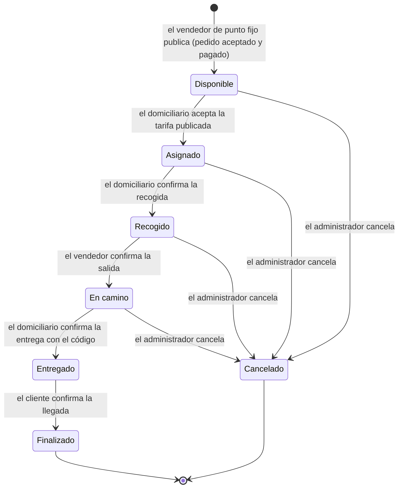

# PLANTILLA DE PROYECTO: EXPERIENCIA FINAL DE DISEÑO

Ñapa - Plataforma para vendedores informales y pequeños comerciantes.

## INFORMACIÓN GENERAL

- **Programa:** Ingeniería de Sistemas (Universidad del Magdalena)
- **Curso:** Proyecto Culminante de Diseño
- **Código del curso:** 9011655
- **Créditos:** 4
- **Periodo académico:** 2026-2
- **Semestre:** 9

## 1. IDENTIFICACIÓN DEL PROYECTO

- **Título del proyecto:** Ñapa - Plataforma de comercio de cercanía y domicilios para vendedores informales

**Tipo de proyecto:**
- ✅ Productivo - impacta directamente los ingresos diarios de vendedores informales
- ✅ Innovación / transferencia tecnológica - introduce publicación digital, pedidos anticipados y logística de domicilios a un sector que hoy opera de forma verbal/WhatsApp
- ☐ Investigación aplicada
- ☐ Intervención agroambiental

- **Contexto real del problema:** El problema se presenta en el comercio informal de Santa Marta. Según el Departamento Administrativo Nacional de Estadística (DANE), la tasa de informalidad laboral de la ciudad alcanzó el **56,9 %** en el trimestre marzo-mayo de 2026, con un promedio histórico reciente del 55,7 %. La situación es aún más aguda en los micronegocios, donde la informalidad escala al **84,5 %**. La población objetivo está constituida por vendedores ambulantes, de carretilla, de alimentos preparados y pequeños negocios familiares que operan en calles, barrios, parques y zonas turísticas, ya sea desplazándose (vendedores ambulantes) o desde un puesto o local fijo (vendedores de punto fijo). Una muestra de la alta densidad comercial en el espacio público local es la Carrera 5.ª del Centro Histórico, donde el censo del Sistema Estratégico de Transporte Público (SETP) de Santa Marta caracterizó a **546 vendedores informales** compitiendo en una sola vía.

  A nivel operativo, la Encuesta de Micronegocios (EMICRON) del DANE muestra que el **97,2 %** de estos comerciantes trabaja de manera independiente por cuenta propia y que el **88,0 %** es la única persona a cargo de su unidad productiva. Según la caracterización del DANE sobre la ocupación del espacio público, el **59,3 %** son vendedores móviles y el **40,7 %** estacionarios, distribución que sustenta los dos perfiles de vendedor de la plataforma. Además, el **58,2 %** creó su negocio porque no tenía otra alternativa de ingresos, lo que convierte la venta diaria en el único sustento familiar ("si hoy no vendo, hoy no gano").

  Actualmente estos comerciantes operan sin un canal digital de venta estructurado. Según la EMICRON, el **82,4 %** de los micronegocios de calle no lleva registro ni sistemas contables por considerar que "no los necesita", y el **99,8 %** de las transacciones se realiza en efectivo, aunque la aceptación de transferencias bancarias o pagos por internet ha ascendido al 19,4 %. Esto genera tres barreras operativas críticas, sustentadas en las entrevistas de campo:
  1. **Dependencia exclusiva del tránsito peatonal:** la capacidad de venta depende estrictamente de las personas que transitan frente al punto de ubicación.
  2. **Incapacidad de conectar oferta y demanda antes de salir:** los vendedores compran o preparan mercancía basándose únicamente en estimaciones de experiencia, sin herramientas para anunciar su inventario con anticipación ni recibir pedidos previos.
  3. **Pérdida económica por desperdicio de mercancía:** en productos de alta perecibilidad (frutas, pescado y alimentos preparados), la mercancía no vendida al final de la jornada se deteriora o pierde por completo su valor comercial.

  El detalle completo del problema, su formulación técnica y la evidencia recogida en campo está documentado en [`investigacion/problema.md`](../investigacion/problema.md).

- **Duración del proyecto:** 4 meses

**Trabajo:**
- ☐ Individual
- ✅ En equipo
- **Integrantes (5):** Iván Marchena, Eduardo Vergara, Stiven Navarro, Camilo Jiménez, Rafael Acuña.

## 2. DESCRIPCIÓN DEL PROBLEMA DE INGENIERÍA

**Situación problemática identificada:** En Santa Marta, con una informalidad laboral general del 56,9 % y del 84,5 % en micronegocios (DANE), una parte fundamental de la economía popular la integran comerciantes informales (carretilleros, vendedores ambulantes, de alimentos preparados y pequeños negocios familiares) que dependen diariamente de la venta de sus productos para sostener sus hogares. Estos comerciantes no pueden dar visibilidad a su oferta más allá del lugar físico donde se ubican, carecen de un canal estructurado para recibir pedidos anticipados y dependen de mecanismos informales (voz a voz, llamadas, WhatsApp, carteles) que no permiten gestionar de forma ordenada el inventario, los pedidos ni las entregas. De acuerdo con la evidencia de campo, esta situación es crítica para quienes comercializan productos perecederos (frutas, pescado, alimentos preparados), donde la mercancía no vendida en el día se traduce en pérdida económica directa.

Por su parte, los consumidores cercanos no disponen de un medio para conocer qué vendedores están en su entorno, qué productos ofrecen, a qué precio y en qué cantidad, lo que restringe sus opciones de compra y mantiene al vendedor en una estricta dependencia del tránsito peatonal voluntario.

**Necesidad o demanda del entorno:** Las 5 entrevistas semiestructuradas realizadas ([`investigacion/entrevistas.md`](../investigacion/entrevistas.md)) y las estadísticas oficiales del DANE confirman de forma consistente cuatro demandas clave:
1. **Incertidumbre de demanda** al comprar o preparar mercancía sin conocer las ventas del día, en un contexto donde el 58,2 % de los vendedores opera sin otra alternativa de ingresos (EMICRON).
2. **Alto riesgo económico en productos perecederos** de vida útil corta.
3. **Existencia real de pedidos anticipados**, manejados de forma precaria por WhatsApp o llamadas.
4. **El domicilio como oportunidad no resuelta:** según la EMICRON, el 88,0 % de los comerciantes trabaja solo, y las entrevistas confirman que abandonar el punto de venta para entregar implica perder ventas presenciales o dejar la mercancía sola.

**Usuarios o beneficiarios:**
- **Vendedor ambulante (59,3 % del sector, según el DANE):** vendedor de carretilla, de termo o de puesto móvil que se desplaza para vender. Atiende pedidos de *entrega directa* (va hasta donde está el cliente), inmediatos o marcados como reserva.
- **Vendedor de punto fijo (40,7 % del sector, según el DANE):** vendedor de alimentos preparados, pequeño negocio familiar o comerciante con establecimiento. Atiende pedidos de *recogida* en su punto (inmediatos o reservas) y ofrece *domicilios* mediante domiciliarios.
- **Cliente:** consumidor cercano que quiere descubrir, consultar y comprar productos informales sin depender de coincidir físicamente con el vendedor en la calle.
- **Domiciliario:** actor independiente que genera ingresos adicionales realizando entregas para vendedores de punto fijo que no pueden abandonar su punto de venta; ve la ganancia de cada domicilio y decide si lo acepta con la tarifa publicada o lo rechaza.

**Justificación: ¿por qué la solución debe ser un software?**
1. **Es un problema de asimetría de información y coordinación.** La oferta (vendedor) y la demanda (cliente) existen en el mismo sector, pero no coinciden por falta de visibilidad en tiempo real. Un software lo resuelve de forma instantánea y a costo marginal casi nulo mediante geolocalización e inventario actualizado, algo imposible con medios físicos o tradicionales.
2. **Apalancamiento en modelos probados.**
  - *Rappi / DoorDash:* demostraron que la tecnología permite a pequeños comercios vender a domicilio sin flota propia, integrando repartidores independientes.
  - *Uber / DiDi:* demostraron que el software formaliza en tiempo real un mercado disperso e itinerante mediante mapas interactivos.
  - *Mercado Libre:* evidenció que una vitrina digital multiplica el alcance geográfico del comerciante sin exigir locales físicos ni grandes costos fijos.
3. **Bajo costo y alta adopción.** El 88,0 % trabaja solo y el 82,4 % no lleva contabilidad. Una aplicación móvil ligera no exige inversión en infraestructura, aprovecha el smartphone que el comerciante ya posee y reduce la interacción al flujo esencial: *publicar → recibir pedido → confirmar → vender*.
4. **Sustituye la intuición por predictibilidad.** Permitir reservas y pedidos previos convierte la incertidumbre en demanda conocida, evitando que los productos perecederos se pierdan y protegiendo el ingreso diario de familias vulnerables. Socialmente, la solución impacta directamente a un sector vulnerable de la economía informal santamartense y amplía el mercado del vendedor más allá de su ubicación física.

**Fuentes de las cifras:** DANE, Gran Encuesta Integrada de Hogares (informalidad laboral, trimestre marzo-mayo 2026); DANE, Encuesta de Micronegocios (EMICRON) y caracterización de la ocupación del espacio público; censo del Sistema Estratégico de Transporte Público (SETP) de Santa Marta, Carrera 5.ª del Centro Histórico.

## 3. RESTRICCIONES Y CONDICIONANTES DEL DISEÑO

- ✅ Técnicas
- ✅ Económicas
- ☐ Ambientales
- ✅ Sociales y culturales
- ✅ Normativas y legales
- ☐ Salud y seguridad
- ✅ Éticas

**Descripción detallada de la incorporación de restricciones:**

- **Técnicas:** los vendedores operan en la calle durante toda su jornada, sin garantía de conexión estable a internet ni de datos móviles constantes, y muchos usan equipos de gama baja con almacenamiento
  y capacidad de procesamiento limitados. Esto condiciona el diseño para que funcionalidades críticas como publicar disponibilidad o consultar pedidos toleren conectividad intermitente y sincronicen cuando la
  señal se recupere, en vez de requerir una conexión permanente (RNF28 y RNF31).
- **Económicas:** los vendedores informales no tienen presupuesto para tecnología costosa ni comisiones altas por transacción. Además, según la EMICRON, el 99,8 % de sus transacciones se realiza en efectivo y solo el 19,4 % acepta transferencias o pagos por internet. Esto llevó a decidir que la plataforma no procese pagos: no integra pasarelas ni maneja
  tarjetas o billeteras electrónicas de terceros. El dinero se mueve fuera de la aplicación, en efectivo o por transferencia directa a la cuenta del vendedor (y, en el pago de la tarifa de un domicilio, a la cuenta del domiciliario),
  y la plataforma solo registra la confirmación de cada cobro (RNF29). Así no hay comisiones ni intermediación financiera.
- **Sociales y culturales:** las entrevistas mostraron vendedores mayores con temor a herramientas complicadas ("Yo no tengo tiempo para estar aprendiendo cosas difíciles" - Sergio, entrevista #3), y el 82,4 % de los micronegocios de calle no lleva registros contables por considerar que no los necesita.
  El diseño de casos de uso privilegia flujos cortos (publicar → recibir pedido → confirmar → vender) y evita catálogos o formularios extensos. Por la misma razón, el vendedor decide las reservas con su propio criterio en lugar de
  mantener un inventario por fecha.
- **Normativas y legales:** el manejo de ubicación (para calcular cercanía) y de datos personales (nombre, teléfono, foto) debe cumplir la Ley 1581 de Protección de Datos Personales.
  Esto se refleja en RNF04 (Privacidad) y en que el sistema restringe el acceso a datos personales únicamente a usuarios autorizados según su rol (RNF03).
- **Éticas:** el sistema de calificación bidireccional (Cliente ↔ Vendedor ↔ Domiciliario) introduce un riesgo real de sesgo, por ejemplo calificaciones usadas como represalia,
  o domiciliarios calificados injustamente por demoras fuera de su control (tráfico, clima). Por eso se incluyeron casos de uso de moderación (Eliminar comentario, Editar comentario) con intervención del Administrador.

## 4. ANÁLISIS Y ESPECIFICACIÓN DE REQUERIMIENTOS

Este capítulo resume el análisis realizado hasta el momento: actores, casos de uso, requerimientos funcionales y no funcionales, y las especificaciones por requerimiento. El detalle completo vive en los archivos del repositorio, que son la fuente de verdad:
[`casos de uso/`](../casos%20de%20uso/) · [`investigacion/HistoriasDeUsuario/historias_de_usuario.md`](../investigacion/HistoriasDeUsuario/historias_de_usuario.md) · [`requerimientos/funcionales.md`](../requerimientos/funcionales.md) · [`requerimientos/no-funcionales.md`](../requerimientos/no-funcionales.md) · [`requerimientos/trazabilidad.md`](../requerimientos/trazabilidad.md) · [`specs/`](../specs/).

**Criterio de modelado.** Un caso de uso corresponde a una pantalla o acción (un botón o una vista) que el usuario final realiza en la aplicación; no es un CRUD de una entidad. Los filtros, ordenamientos y validaciones (por ejemplo, filtrar un listado por fecha) son funcionalidad del caso de uso y se detallan en su especificación, no como casos de uso aparte.

### 4.1 Actores y roles

El vendedor no es un único rol: los vendedores ambulantes y los de punto fijo tienen flujos distintos, por lo que el actor *Vendedor* es abstracto y se especializa en dos roles que el usuario elige al crear su cuenta.

| Actor | Descripción |
|---|---|
| **Usuario** | Actor base con las funcionalidades comunes (cuenta y notificaciones). |
| **Cliente** | Descubre emprendimientos cercanos y hace pedidos en las modalidades de entrega directa, recogida en punto fijo o domicilio, pudiendo marcarlos como reserva. |
| **Vendedor** *(abstracto)* | Administra su emprendimiento y sus productos y atiende pedidos (listar, ver detalle, aceptar o rechazar). |
| **Vendedor ambulante** | Se desplaza para vender. Atiende entregas directas, inmediatas o marcadas como reserva. |
| **Vendedor de punto fijo** | Vende desde un puesto o local fijo. Atiende recogidas (inmediatas o reservas) y ofrece domicilios, que publica una vez el pedido está aceptado y pagado. |
| **Domiciliario** | Lleva un pedido del punto fijo al cliente; ve la ganancia de cada domicilio y lo acepta con la tarifa publicada o lo rechaza de forma definitiva. No negocia el precio. |
| **Administrador** | Supervisa usuarios, domicilios, pagos, comentarios y reportes, y define la tarifa mínima de domicilio. |

### 4.2 Modalidades de entrega y flujos por tipo de vendedor

| Modalidad | Vendedor ambulante | Vendedor de punto fijo | Quién lleva o entrega el pedido |
|---|:---:|:---:|---|
| Entrega directa | ✅ | — | El propio vendedor ambulante va hasta la ubicación del cliente. |
| Recogida en punto fijo | — | ✅ | El cliente lo retira personalmente en el punto fijo. |
| Domicilio | — | ✅ | Un domiciliario lo lleva del punto fijo (A) a la ubicación del cliente (B). |

**Reserva** no es una cuarta modalidad: es un atributo del pedido (fecha y hora libremente acordadas con el vendedor) que puede aplicarse sobre cualquiera de las tres modalidades. El vendedor no publica disponibilidad futura: acepta o rechaza cada reserva con su propio criterio (RF-53) y, llegada la fecha, el pedido sigue el flujo de su modalidad.

**Entrega directa (vendedor ambulante).** El cliente realiza el pedido (RF-45) → el vendedor ambulante recibe la notificación (RF-38) y lo acepta o rechaza (RF-53) → consulta la ubicación del cliente en el mapa (RF-35) → inicia la entrega (RF-36) → confirma la entrega y el cobro, en efectivo o por transferencia a su cuenta, según lo que acepte (RF-37, RF-42, RF-63). Si el pedido es una reserva, el flujo es el mismo en la fecha acordada.

**Recogida en punto fijo (vendedor de punto fijo).** El cliente consulta el emprendimiento, donde ve la ubicación y el horario del punto (RF-32), y hace el pedido (RF-45) → el vendedor lo acepta o rechaza (RF-53) → lo marca como listo para recoger (RF-64) → el cliente lo retira y el vendedor confirma el retiro y el cobro, en efectivo o por transferencia (RF-65, RF-42). Si el pedido es una reserva, el flujo es el mismo en la fecha acordada.

**Domicilio (vendedor de punto fijo).**
1. El cliente pide el domicilio indicando su ubicación y ve el total (productos más tarifa del domicilio) y que deberá pagarlo por transferencia apenas el vendedor acepte (RF-45).
2. El vendedor acepta el pedido (RF-53), para lo cual debe tener una cuenta bancaria registrada (RF-63).
3. El cliente transfiere el total a la cuenta del vendedor y el vendedor confirma la recepción (RF-42). **Solo entonces** puede publicar el domicilio (RF-14), que **no puede editarse**.
4. Los domiciliarios ven los domicilios disponibles con su ganancia (RF-16) y consultan la información (RF-18); pueden **rechazarlos de forma definitiva** (RF-17) o **aceptarlos con la tarifa publicada** (RF-19), sin negociar el precio.
5. El domiciliario ve la ruta en el mapa (RF-22), confirma que recogió el pedido y el vendedor confirma que va en camino (RF-23).
6. El cliente ve su código de confirmación y se lo entrega al domiciliario, quien lo ingresa para confirmar la entrega (RF-24); el cliente confirma la llegada (RF-25).
7. Una vez entregado, el vendedor transfiere la tarifa al domiciliario y registra el pago, y el domiciliario confirma que la recibió (RF-43).

El cliente puede seguir la trazabilidad en todo momento (RF-26).

**Ciclo de vida de un domicilio:**

```mermaid
stateDiagram-v2
  [*] --> Disponible: el vendedor de punto fijo publica (pedido aceptado y pagado)
  Disponible --> Asignado: el domiciliario acepta la tarifa publicada
  Asignado --> Recogido: el domiciliario confirma la recogida
  Recogido --> EnCamino: el vendedor confirma la salida
  EnCamino --> Entregado: el domiciliario confirma la entrega con el código
  Entregado --> Finalizado: el cliente confirma la llegada
  Finalizado --> [*]
  Disponible --> Cancelado: el administrador cancela
  Asignado --> Cancelado: el administrador cancela
  Recogido --> Cancelado: el administrador cancela
  EnCamino --> Cancelado: el administrador cancela
  Cancelado --> [*]
  EnCamino : En camino
```

### 4.3 Casos de uso

Se elaboró un diagrama de nivel 0 y un diagrama por módulo (PlantUML). Los módulos específicos por tipo de vendedor son *Gestionar entregas del vendedor ambulante* y *Gestionar recogida en punto fijo*; *Gestionar domicilios* concentra los flujos de punto fijo, domiciliario y cliente.

| Módulo | Diagrama | Actores | Casos de uso |
|---|---|---|---|
| Nivel 0 | [`nivel0.puml`](../casos%20de%20uso/nivel0.puml) | Todos | 12 módulos |
| Gestionar comentarios y calificaciones | [`gestionar_comentarios_calificaciones.puml`](../casos%20de%20uso/gestionar_comentarios_calificaciones.puml) | Cliente, Vendedor (ambulante y de punto fijo), Domiciliario, Administrador | Calificar y comentar emprendimiento; Calificar y comentar producto; Calificar y comentar domiciliario; Calificar y comentar cliente; Consultar calificaciones y comentarios de un emprendimiento; de un producto; de un domiciliario; de un cliente; Eliminar comentario; Editar comentario |
| Gestionar cuenta | [`gestionar_cuenta.puml`](../casos%20de%20uso/gestionar_cuenta.puml) | Usuario, Administrador | Crear una cuenta; Editar mi cuenta; Cambiar contraseña; Iniciar sesión en mi cuenta; Eliminar mi cuenta |
| Gestionar domicilios | [`gestionar_domicilios.puml`](../casos%20de%20uso/gestionar_domicilios.puml) | Vendedor de punto fijo, Domiciliario, Cliente, Administrador | Publicar domicilio; Listar domicilios; Consultar estado del domicilio; Consultar información del domiciliario; Confirmar salida del domiciliario; Listar domicilios disponibles; Rechazar domicilio; Consultar información del domicilio; Aceptar domicilio; Consultar ruta en el mapa; Confirmar recogida del pedido; Confirmar entrega del pedido; Ingresar código de confirmación; Consultar trazabilidad del domicilio; Confirmar llegada del pedido; Ver código de confirmación; Consultar domicilios; Cancelar domicilio |
| Gestionar emprendimientos | [`gestionar_emprendimientos.puml`](../casos%20de%20uso/gestionar_emprendimientos.puml) | Vendedor, Cliente | Crear emprendimiento; Editar emprendimiento; Eliminar emprendimiento; Listar emprendimientos; Consultar emprendimiento; Listar productos de un emprendimiento; Ver información del vendedor |
| Gestionar entregas del vendedor ambulante | [`gestionar_entrega_ambulante.puml`](../casos%20de%20uso/gestionar_entrega_ambulante.puml) | Vendedor ambulante | Consultar ubicación de entrega; Iniciar entrega; Confirmar entrega directa |
| Gestionar notificaciones | [`gestionar_notificaciones.puml`](../casos%20de%20uso/gestionar_notificaciones.puml) | Usuario | Consultar notificaciones; Configurar preferencias de notificación |
| Gestionar pagos | [`gestionar_pagos.puml`](../casos%20de%20uso/gestionar_pagos.puml) | Cliente, Vendedor, Domiciliario, Administrador | Confirmar pago del pedido; Registrar pago de la tarifa al domiciliario; Confirmar recepción de la tarifa del domicilio; Consultar historial de pagos; Seleccionar método de pago; Seleccionar método de pago aceptados; Configurar tarifa mínima del domicilio |
| Gestionar pedidos | [`gestionar_pedidos.puml`](../casos%20de%20uso/gestionar_pedidos.puml) | Cliente, Vendedor (ambulante y de punto fijo) | Realizar pedido; Seleccionar productos; Seleccionar modalidad de entrega; Indicar ubicación de entrega; Seleccionar método de pago; Listar mis pedidos; Consultar estado del pedido; Contactar vendedor o domiciliario; Listar pedidos recibidos; Consultar detalle del pedido; Ver información del cliente; Aceptar pedido; Rechazar pedido |
| Gestionar productos | [`gestionar_productos.puml`](../casos%20de%20uso/gestionar_productos.puml) | Vendedor | Añadir producto; Listar productos; Editar producto; Actualizar cantidad producto; Eliminar producto; Consultar predicción de demanda *(post-MVP)* |
| Gestionar reportes | [`gestionar_reporte.puml`](../casos%20de%20uso/gestionar_reporte.puml) | Cliente, Vendedor, Domiciliario, Administrador | Reportar problema; Consultar reportes; Resolver reporte |
| Gestionar recogida en punto fijo | [`gestionar_recogida_punto_fijo.puml`](../casos%20de%20uso/gestionar_recogida_punto_fijo.puml) | Vendedor de punto fijo (y Cliente) | Marcar pedido como lista para recoger; Confirmar retiro del pedido |
| Gestionar usuarios | [`gestionar_usuarios.puml`](../casos%20de%20uso/gestionar_usuarios.puml) | Administrador | Consultar un usuario; Editar un usuario; Eliminar un usuario; Listar todos los usuarios |

### 4.4 Requerimientos funcionales

Se definieron **66 requerimientos funcionales** (65 del MVP y RF-59, documentado como mejora futura) derivados de **97 historias de usuario** (96 del MVP y HU-90, post-MVP), organizados en 12 módulos. Los huecos de numeración (RF-20, RF-21 y RF-46) no se reutilizan. La prioridad corresponde a la mayor prioridad entre las historias de su especificación (P1 = núcleo del flujo, P2 = importante, P3 = complementario).

| RF | Requerimiento | Actores | Prioridad | Especificación |
|---|---|---|:---:|---|
| | **Gestionar comentarios y calificaciones** | | | |
| RF-01 | Calificar y comentar entidades | Cliente, Vendedor de punto fijo, Domiciliario, Vendedor | P1 | [RF-01](../specs/RF-01-calificar-y-comentar-entidades.md) |
| RF-02 | Consultar calificaciones y comentarios | Cliente, Vendedor, Vendedor de punto fijo, Domiciliario | P1 | [RF-02](../specs/RF-02-consultar-calificaciones-y-comentarios.md) |
| RF-03 | Supervisión de calificaciones y comentarios | Administrador | P2 | [RF-03](../specs/RF-03-supervision-de-calificaciones-y-comentarios.md) |
| RF-04 | Edición de comentarios propios | Usuario | P2 | [RF-04](../specs/RF-04-edicion-de-comentarios-propios.md) |
| RF-05 | Eliminación de comentarios propios | Usuario | P2 | [RF-05](../specs/RF-05-eliminacion-de-comentarios-propios.md) |
| RF-06 | Moderación de comentarios | Administrador | P1 | [RF-06](../specs/RF-06-moderacion-de-comentarios.md) |
| | **Gestionar cuenta** | | | |
| RF-07 | Registro de cuenta | Usuario | P1 | [RF-07](../specs/RF-07-registro-de-cuenta.md) |
| RF-08 | Edición de datos de cuenta | Usuario | P2 | [RF-08](../specs/RF-08-edicion-de-datos-de-cuenta.md) |
| RF-09 | Cambio de contraseña | Usuario, Administrador | P1 | [RF-09](../specs/RF-09-cambio-de-contrasena.md) |
| RF-10 | Inicio de sesión | Usuario, Administrador | P1 | [RF-10](../specs/RF-10-inicio-de-sesion.md) |
| RF-11 | Eliminación de cuenta | Usuario | P2 | [RF-11](../specs/RF-11-eliminacion-de-cuenta.md) |
| | **Gestionar domicilios** | | | |
| RF-12 | Consulta de domicilios por administrador | Administrador | P3 | [RF-12](../specs/RF-12-consulta-de-domicilios-por-administrador.md) |
| RF-13 | Cancelación de domicilio por administrador | Administrador | P3 | [RF-13](../specs/RF-13-cancelacion-de-domicilio-por-administrador.md) |
| RF-14 | Publicación de domicilio (pedido aceptado y pagado) | Vendedor de punto fijo | P1 | [RF-14](../specs/RF-14-publicacion-de-domicilio.md) |
| RF-15 | Listado de domicilios del vendedor | Vendedor de punto fijo | P2 | [RF-15](../specs/RF-15-listado-de-domicilios-del-vendedor.md) |
| RF-16 | Consulta de domicilios disponibles | Domiciliario | P1 | [RF-16](../specs/RF-16-consulta-de-domicilios-disponibles.md) |
| RF-17 | Rechazo de domicilios | Domiciliario | P2 | [RF-17](../specs/RF-17-rechazo-de-domicilios.md) |
| RF-18 | Consulta de información del domicilio por el domiciliario | Domiciliario | P1 | [RF-18](../specs/RF-18-consulta-de-informacion-del-domicilio-por-el-domiciliario.md) |
| RF-19 | Aceptación de domicilio | Domiciliario | P1 | [RF-19](../specs/RF-19-aceptacion-de-domicilio.md) |
| RF-22 | Ruta en mapa interactivo | Domiciliario | P1 | [RF-22](../specs/RF-22-ruta-en-mapa-interactivo.md) |
| RF-23 | Recogida del pedido y salida del domiciliario | Domiciliario, Vendedor de punto fijo | P1 | [RF-23](../specs/RF-23-recogida-del-pedido-y-salida-del-domiciliario.md) |
| RF-24 | Confirmación de entrega por el domiciliario | Domiciliario | P1 | [RF-24](../specs/RF-24-confirmacion-de-entrega-por-el-domiciliario.md) |
| RF-25 | Confirmación de llegada por el cliente | Cliente | P1 | [RF-25](../specs/RF-25-confirmacion-de-llegada-por-el-cliente.md) |
| RF-26 | Estado y trazabilidad del domicilio | Cliente, Vendedor de punto fijo | P1 | [RF-26](../specs/RF-26-estado-y-trazabilidad-del-domicilio.md) |
| RF-27 | Consulta de información del domiciliario | Vendedor de punto fijo, Cliente | P2 | [RF-27](../specs/RF-27-consulta-de-informacion-del-domiciliario.md) |
| | **Gestionar emprendimientos** | | | |
| RF-28 | Creación de emprendimiento | Vendedor | P1 | [RF-28](../specs/RF-28-creacion-de-emprendimiento.md) |
| RF-29 | Edición de emprendimiento | Vendedor | P2 | [RF-29](../specs/RF-29-edicion-de-emprendimiento.md) |
| RF-30 | Eliminación de emprendimiento | Vendedor | P3 | [RF-30](../specs/RF-30-eliminacion-de-emprendimiento.md) |
| RF-31 | Listado de emprendimientos | Cliente | P1 | [RF-31](../specs/RF-31-listado-de-emprendimientos.md) |
| RF-32 | Consulta de emprendimiento | Cliente | P1 | [RF-32](../specs/RF-32-consulta-de-emprendimiento.md) |
| RF-33 | Listado de productos de un emprendimiento | Cliente | P2 | [RF-33](../specs/RF-33-listado-de-productos-de-un-emprendimiento.md) |
| RF-34 | Consulta de información del vendedor | Cliente | P3 | [RF-34](../specs/RF-34-consulta-de-informacion-del-vendedor.md) |
| | **Gestionar entregas del vendedor ambulante** | | | |
| RF-35 | Consulta de ubicación de entrega | Vendedor ambulante | P1 | [RF-35](../specs/RF-35-consulta-de-ubicacion-de-entrega.md) |
| RF-36 | Inicio de entrega directa | Vendedor ambulante | P1 | [RF-36](../specs/RF-36-inicio-de-entrega-directa.md) |
| RF-37 | Confirmación de entrega directa | Vendedor ambulante | P1 | [RF-37](../specs/RF-37-confirmacion-de-entrega-directa.md) |
| | **Gestionar notificaciones** | | | |
| RF-38 | Consulta de notificaciones | Usuario | P2 | [RF-38](../specs/RF-38-consulta-de-notificaciones.md) |
| RF-39 | Configuración de preferencias de notificación | Usuario | P3 | [RF-39](../specs/RF-39-configuracion-de-preferencias-de-notificacion.md) |
| | **Gestionar pagos** | | | |
| RF-40 | Consulta de historial de pagos | Cliente, Vendedor, Domiciliario | P2 | [RF-40](../specs/RF-40-consulta-de-historial-de-pagos.md) |
| RF-41 | Consulta de historial general de pagos | Administrador | P3 | [RF-41](../specs/RF-41-consulta-de-historial-general-de-pagos.md) |
| RF-42 | Confirmación de pago del pedido | Vendedor | P1 | [RF-42](../specs/RF-42-confirmacion-de-pago-del-pedido.md) |
| RF-43 | Confirmación del pago de la tarifa del domicilio | Vendedor de punto fijo, Domiciliario | P2 | [RF-43](../specs/RF-43-confirmacion-del-pago-de-la-tarifa-del-domicilio.md) |
| RF-44 | Configuración de tarifa mínima de domicilio | Administrador | P3 | [RF-44](../specs/RF-44-configuracion-de-tarifa-minima-de-domicilio.md) |
| RF-63 | Configuración de métodos de pago aceptados por el vendedor | Vendedor | P1 | [RF-63](../specs/RF-63-configuracion-de-metodos-de-pago-aceptados.md) |
| | **Gestionar pedidos** | | | |
| RF-45 | Realización de pedido | Cliente | P1 | [RF-45](../specs/RF-45-realizacion-de-pedido.md) |
| RF-47 | Listado de pedidos del cliente | Cliente | P2 | [RF-47](../specs/RF-47-listado-de-pedidos-del-cliente.md) |
| RF-48 | Consulta del estado del pedido | Cliente | P1 | [RF-48](../specs/RF-48-consulta-del-estado-del-pedido.md) |
| RF-49 | Contacto con vendedor o domiciliario | Cliente | P2 | [RF-49](../specs/RF-49-contacto-con-vendedor-o-domiciliario.md) |
| RF-50 | Listado de pedidos del vendedor | Vendedor | P1 | [RF-50](../specs/RF-50-listado-de-pedidos-del-vendedor.md) |
| RF-51 | Consulta de detalle de pedido | Vendedor | P1 | [RF-51](../specs/RF-51-consulta-de-detalle-de-pedido.md) |
| RF-52 | Consulta de información del cliente | Vendedor | P2 | [RF-52](../specs/RF-52-consulta-de-informacion-del-cliente.md) |
| RF-53 | Respuesta del vendedor a un pedido | Vendedor | P1 | [RF-53](../specs/RF-53-respuesta-del-vendedor-a-un-pedido.md) |
| | **Gestionar productos** | | | |
| RF-54 | Registro de producto | Vendedor | P1 | [RF-54](../specs/RF-54-registro-de-producto.md) |
| RF-55 | Listado de productos del vendedor | Vendedor | P1 | [RF-55](../specs/RF-55-listado-de-productos-del-vendedor.md) |
| RF-56 | Edición de producto | Vendedor | P2 | [RF-56](../specs/RF-56-edicion-de-producto.md) |
| RF-57 | Actualización de inventario del producto | Vendedor | P1 | [RF-57](../specs/RF-57-actualizacion-de-inventario-del-producto.md) |
| RF-58 | Eliminación de producto | Vendedor | P2 | [RF-58](../specs/RF-58-eliminacion-de-producto.md) |
| RF-59 | Predicción de demanda *(fuera del MVP)* | Vendedor | P3 | [RF-59](../specs/RF-59-prediccion-de-demanda.md) |
| | **Gestionar reportes** | | | |
| RF-60 | Creación de reportes | Cliente, Vendedor, Domiciliario | P1 | [RF-60](../specs/RF-60-creacion-de-reportes.md) |
| RF-61 | Consulta de reportes por administrador | Administrador | P2 | [RF-61](../specs/RF-61-consulta-de-reportes-por-administrador.md) |
| RF-62 | Resolución de reportes | Administrador | P2 | [RF-62](../specs/RF-62-resolucion-de-reportes.md) |
| | **Gestionar recogida en punto fijo** | | | |
| RF-64 | Recogida lista para retirar | Vendedor de punto fijo | P1 | [RF-64](../specs/RF-64-recogida-lista-para-recoger.md) |
| RF-65 | Confirmación de retiro del pedido | Vendedor de punto fijo | P1 | [RF-65](../specs/RF-65-confirmacion-de-retiro-del-pedido.md) |
| | **Gestionar usuarios** | | | |
| RF-66 | Consulta de usuario por administrador | Administrador | P2 | [RF-66](../specs/RF-66-consulta-de-usuario-por-administrador.md) |
| RF-67 | Edición de usuario por administrador | Administrador | P3 | [RF-67](../specs/RF-67-edicion-de-usuario-por-administrador.md) |
| RF-68 | Eliminación de usuario por administrador | Administrador | P3 | [RF-68](../specs/RF-68-eliminacion-de-usuario-por-administrador.md) |
| RF-69 | Listado de usuarios | Administrador | P2 | [RF-69](../specs/RF-69-listado-de-usuarios.md) |

### 4.5 Requerimientos no funcionales

Se definieron **31 requerimientos no funcionales**. La tolerancia a conectividad intermitente (RNF28) y los medios de pago admitidos (RNF29: efectivo o transferencia a la cuenta del vendedor, sin que la plataforma procese el dinero) responden directamente a las restricciones de diseño de la sección 3.

| ID | Categoría | Requerimiento |
|---|---|---|
| RNF01 | Seguridad y privacidad | **Seguridad.** El sistema deberá almacenar las contraseñas de los usuarios utilizando mecanismos seguros de cifrado o hash. |
| RNF02 | Seguridad y privacidad | **Autenticación.** El sistema deberá validar las credenciales de los usuarios y del administrador antes de permitir el acceso a sus cuentas. |
| RNF03 | Seguridad y privacidad | **Autorización.** El sistema deberá restringir el acceso a las funcionalidades según el rol del usuario (cliente, vendedor ambulante, vendedor de punto fijo, domiciliario o administrador). |
| RNF04 | Seguridad y privacidad | **Privacidad.** El sistema deberá proteger la información personal de los usuarios, incluida su ubicación, conforme a la Ley 1581 de 2012 de Protección de Datos Personales, y permitir su acceso únicamente a usuarios autorizados. La ubicación del cliente solo podrá compartirse con el vendedor o el domiciliario de un pedido o domicilio activo. |
| RNF05 | Integridad y fiabilidad de los datos | **Integridad de datos.** El sistema deberá garantizar la consistencia de la información de usuarios, emprendimientos, productos, pedidos, reservas, domicilios, pagos, comentarios y reportes. |
| RNF06 | Rendimiento, disponibilidad y escalabilidad | **Disponibilidad.** El sistema deberá estar disponible para los usuarios durante el horario establecido de operación. |
| RNF07 | Rendimiento, disponibilidad y escalabilidad | **Rendimiento.** Las operaciones principales del sistema deberán responder en un tiempo máximo de 3 segundos bajo condiciones normales de funcionamiento. |
| RNF08 | Rendimiento, disponibilidad y escalabilidad | **Concurrencia.** El sistema deberá controlar operaciones simultáneas sobre productos, pedidos y domicilios (por ejemplo, dos domiciliarios aceptando el mismo domicilio o dos clientes pidiendo la última unidad disponible de un producto) para evitar inconsistencias. |
| RNF09 | Usabilidad, compatibilidad y conectividad | **Usabilidad.** La interfaz deberá ser intuitiva y permitir que los usuarios comprendan fácilmente las funcionalidades disponibles según su rol. Los flujos principales de cada rol (publicar, recibir pedido, confirmar y vender) deberán ser cortos y evitar formularios extensos. |
| RNF10 | Usabilidad, compatibilidad y conectividad | **Accesibilidad.** El sistema deberá utilizar una interfaz que facilite su uso por personas con diferentes capacidades y dispositivos. |
| RNF11 | Usabilidad, compatibilidad y conectividad | **Compatibilidad.** El sistema deberá funcionar correctamente en dispositivos móviles, tabletas y computadores. |
| RNF12 | Rendimiento, disponibilidad y escalabilidad | **Escalabilidad.** El sistema deberá permitir el crecimiento en número de usuarios, emprendimientos, productos, pedidos, domicilios, pagos y comentarios sin afectar significativamente su funcionamiento. |
| RNF13 | Arquitectura y evolución | **Mantenibilidad.** El sistema deberá estar desarrollado mediante una arquitectura modular que facilite la modificación, actualización y mantenimiento de sus componentes. |
| RNF14 | Arquitectura y evolución | **Extensibilidad.** El sistema deberá permitir incorporar nuevos roles, funcionalidades, modalidades de entrega y tipos de servicios sin requerir modificaciones extensas en los componentes existentes. |
| RNF15 | Integridad y fiabilidad de los datos | **Fiabilidad.** El sistema deberá manejar errores y excepciones de manera controlada sin provocar pérdida o corrupción de información. |
| RNF16 | Información, notificaciones e integración | **Trazabilidad.** El sistema deberá registrar las fechas de creación y última actualización de las entidades que requieran seguimiento, y la cronología de estados de cada domicilio. |
| RNF17 | Información, notificaciones e integración | **Actualización de información.** Los cambios realizados sobre productos, pedidos, reservas, domicilios y pagos deberán reflejarse oportunamente para los usuarios involucrados. |
| RNF18 | Información, notificaciones e integración | **Notificaciones.** El sistema deberá entregar oportunamente las notificaciones relacionadas con cambios en pedidos, reservas, domicilios, pagos y reportes. |
| RNF19 | Información, notificaciones e integración | **Interoperabilidad.** El sistema deberá permitir la integración con servicios externos necesarios para funcionalidades como mapas y rutas o comunicación. |
| RNF20 | Integridad y fiabilidad de los datos | **Recuperación.** El sistema deberá contar con mecanismos que permitan recuperar la información ante fallos del sistema o pérdida de datos. |
| RNF21 | Integridad y fiabilidad de los datos | **Auditoría.** El sistema deberá permitir identificar las operaciones relevantes realizadas sobre pedidos, reservas, domicilios, pagos y reportes. |
| RNF22 | Información, notificaciones e integración | **Localización.** El sistema deberá utilizar la información de ubicación de manera consistente para calcular distancias, tarifas y rutas, mostrar emprendimientos cercanos y mostrar la ubicación del cliente y del domiciliario cuando corresponda. |
| RNF23 | Integridad y fiabilidad de los datos | **Consistencia de estados.** El sistema deberá garantizar que los estados de productos, pedidos, reservas, domicilios, pagos y reportes solo puedan cambiar mediante transiciones válidas (por ejemplo, un domicilio avanza en la secuencia disponible → asignado → recogido → en camino → entregado → finalizado, o pasa a cancelado). |
| RNF24 | Usabilidad, compatibilidad y conectividad | **Protección ante errores.** El sistema deberá mostrar mensajes claros al usuario cuando una operación no pueda completarse. |
| RNF25 | Arquitectura y evolución | **Arquitectura.** El sistema deberá mantener una separación clara de responsabilidades entre sus diferentes componentes y capas para facilitar su evolución. |
| RNF26 | Seguridad y privacidad | **Moderación de contenido.** El sistema deberá proveer mecanismos que permitan controlar y moderar el contenido generado por los usuarios (comentarios y calificaciones) para prevenir contenido ofensivo, fraudulento o abusivo. |
| RNF27 | Integridad y fiabilidad de los datos | **Integridad de pagos.** El sistema deberá registrar cada pago, en efectivo o digital, una sola vez, evitando confirmaciones duplicadas, incompletas o asociadas a un pedido o domicilio que no corresponde. |
| RNF28 | Usabilidad, compatibilidad y conectividad | **Tolerancia a conectividad intermitente.** Las funcionalidades críticas para vendedores y domiciliarios (publicar disponibilidad, consultar y responder pedidos, confirmar entregas) deberán tolerar conectividad intermitente y sincronizar la información cuando la señal se recupere. |
| RNF29 | Seguridad y privacidad | **Medios de pago admitidos.** El sistema deberá admitir dos medios de pago: efectivo y transferencia a la cuenta bancaria que el vendedor registre. La entrega directa y la recogida en punto fijo admiten efectivo o cuenta bancaria, según lo que el vendedor haya configurado como aceptado; el domicilio admite exclusivamente pago digital a la cuenta del vendedor, sin cobro en efectivo al domiciliario. El sistema no deberá procesar ni almacenar datos de tarjetas ni billeteras electrónicas de terceros: solo registra la confirmación del cobro en efectivo o la transferencia a la cuenta registrada por el vendedor. |
| RNF30 | Rendimiento, disponibilidad y escalabilidad | **Seguimiento oportuno de domicilios.** Los cambios de estado de un domicilio y la ubicación del domiciliario deberán ser visibles para el cliente en un máximo de 30 segundos. |
| RNF31 | Rendimiento, disponibilidad y escalabilidad | **Eficiencia en dispositivos de gama baja.** El sistema deberá funcionar de forma fluida en dispositivos móviles de gama baja, con almacenamiento y capacidad de procesamiento limitados. |

### 4.6 Especificaciones por requerimiento

Cada requerimiento funcional cuenta con una especificación en `specs/` (66 archivos, uno por RF) con el formato de *Feature Specification*: historias de usuario priorizadas (P1, P2, P3) con su prueba independiente y escenarios de aceptación *Given / When / Then*, casos borde, requerimientos verificables (`FR-NNN`), entidades clave y criterios de éxito medibles (`SC-NNN`).

| Prioridad | Especificaciones |
|---|:---:|
| P1 – núcleo del flujo | 34 |
| P2 – importante | 22 |
| P3 – complementario | 10 |
| **Total** | **66** |

### 4.7 Trazabilidad

La matriz [`requerimientos/trazabilidad.md`](../requerimientos/trazabilidad.md) relaciona, para cada módulo, la historia de usuario, el actor, el caso de uso, el requerimiento funcional y su especificación (97 historias → 66 requerimientos → 66 especificaciones → 12 diagramas de casos de uso), e incluye el resumen de huecos de numeración. Todas las historias de usuario están cubiertas por exactamente un requerimiento.

### 4.8 Decisiones de diseño y supuestos

**Decisiones tomadas:**

1. **Vendedor con dos roles.** Ambulante y de punto fijo, definidos al crear la cuenta, con casos de uso distintos.
2. **El domicilio no se edita.** Un domicilio solo lleva un pedido del punto A al punto B; se eliminó la edición.
3. **Código de confirmación en la entrega.** Al asignarse el domicilio se genera un código que el cliente ve y entrega al domiciliario, quien lo ingresa para confirmar la entrega. El cliente confirma además la llegada: el código refuerza, no reemplaza, la doble confirmación.
4. **Rechazo definitivo, no archivado.** El domiciliario rechaza de forma definitiva los domicilios que no le interesan; el domicilio sigue disponible para los demás, sin notificar ni penalizar a nadie. No existe lista de rechazados ni restauración.
5. **El domiciliario no negocia el precio.** Acepta el domicilio con la tarifa publicada, que calcula el sistema según la distancia entre los puntos A y B sin ser inferior a la tarifa mínima, o lo rechaza. Se eliminó la oferta de precio (RF-20 y RF-21).
6. **Pago mixto, sin que la plataforma procese el dinero.** Efectivo o transferencia a la cuenta del vendedor en entrega directa y recogida (según lo que el vendedor acepte); el domicilio es exclusivamente digital. La plataforma solo registra la confirmación de cada cobro.
7. **Orden de pago del domicilio.** El vendedor acepta el pedido, el cliente transfiere un único monto (productos más tarifa del domicilio) y el vendedor confirma la recepción; solo entonces puede publicar el domicilio. Tras la entrega, el vendedor paga la tarifa al domiciliario y ambos lo confirman (RF-43).
8. **Reservas por criterio del vendedor.** La reserva es un atributo del pedido (fecha y hora acordadas con el vendedor). No existe inventario por fecha: el vendedor acepta o rechaza cada reserva con su propio criterio (se eliminó RF-46).
9. **Predicción de demanda fuera del MVP.** RF-59 se conserva documentado como mejora futura para apoyar al vendedor en sus decisiones de compra, preparación y reservas.
10. **Tarifa del domicilio.** La ganancia del domiciliario es la tarifa publicada, sin comisión de la plataforma.

**Puntos pendientes de validar con el equipo y los usuarios:**

- Pedido de domicilio aceptado sin pago del cliente: no se define plazo ni cancelación automática; el domicilio simplemente no puede publicarse.
- Tarifa al domiciliario: qué ocurre si el vendedor no la paga tras la entrega (sin plazo ni escalamiento definidos) o si el domiciliario dice no haberla recibido.
- Verificación de transferencias: cómo comprueba el vendedor que la transferencia recibida corresponde al pedido y al monto, dado que la plataforma no procesa el dinero.
- Vencimientos: qué ocurre si el vendedor no responde a un pedido (incluida una reserva antes de su fecha) o si el cliente no confirma la llegada.
- Reservas: si puede reservarse un producto que hoy figura como agotado y cuándo se descuenta el inventario de una reserva aceptada.
- Privacidad del destino: si la dirección exacta y el nombre de quien recibe se muestran al domiciliario antes o después de la asignación.
- Límite de domicilios simultáneos por domiciliario.
- Reglas para el vendedor ambulante cuando el cliente está demasiado lejos para una entrega directa.