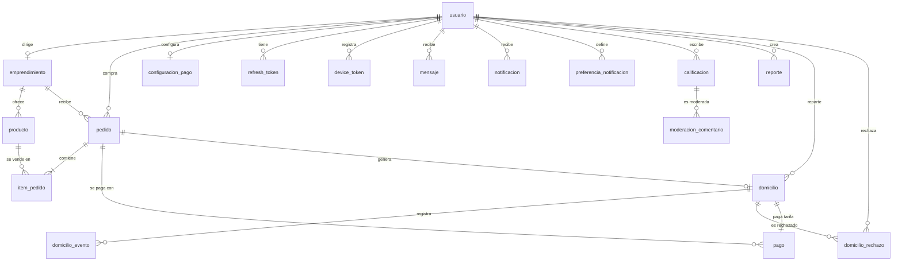

# Spec general de Ñapa

**Updated**: 2026-10-05
**Alcance**: reglas compartidas por todos los requerimientos: roles, convenciones de API, modelo de datos y estados.
**Fuentes**: `requerimientos/funcionales.md` (reglas del dominio), `investigacion/HistoriasDeUsuario/historias_de_usuario.md` (actores), `capstone/informe-capstone.md`.

> Los planes técnicos (`specs/RF-NN-*/plan.md`) **no redefinen** el modelo de datos ni las convenciones: las referencian. Si una feature necesita un cambio de esquema, se corrige primero este documento.

## 1. Roles y actores

| Término del dominio | Rol en el sistema (`usuario.rol`) | Descripción |
|---|---|---|
| **Comprador** (en las specs: *Cliente*) | `CLIENTE` | Descubre emprendimientos, hace pedidos, paga, califica. |
| **Vendedor** *(abstracto)* | `VENDEDOR_AMBULANTE` o `VENDEDOR_PUNTO_FIJO` | Administra su emprendimiento y productos y atiende pedidos. El tipo se elige al crear la cuenta. |
| Vendedor ambulante | `VENDEDOR_AMBULANTE` | Entrega directa; no ofrece recogida ni domicilio. |
| Vendedor de punto fijo | `VENDEDOR_PUNTO_FIJO` | Recogida en el punto y domicilio mediante domiciliarios. |
| **Domiciliario** | `DOMICILIARIO` | Lleva pedidos del punto A al punto B; acepta la tarifa publicada o rechaza. |
| **Administrador** | `ADMINISTRADOR` | Supervisa usuarios, domicilios, pagos, comentarios y reportes. |
| Usuario | (actor base) | Funciones comunes: cuenta y notificaciones. |

**Pedidos: quién interviene.** El *comprador* crea el pedido y lo consulta (RF-45, RF-47, RF-48, RF-49). El *vendedor* lo lista, ve el detalle, consulta al comprador y lo acepta o rechaza (RF-50 a RF-53). Las modalidades por tipo de vendedor están en `funcionales.md` (Reglas generales) y en el informe §4.2. La **reserva** es un atributo del pedido, no una modalidad.

> En el código y la API se mantiene `CLIENTE`/`cliente` por coherencia con las 66 specs. "Comprador" es el nombre del rol en los documentos de diseño.

## 2. Convenciones de API

Prefijo `/api/v1`. JSON en UTF-8. Fechas ISO-8601 UTC. Enumeraciones en MAYÚSCULAS. Dinero en pesos colombianos como entero (`tarifa`, `total`).

### 2.1 Cabeceras

| Cabecera | Sentido | Cuándo | Contenido |
|---|---|---|---|
| `Authorization` | Request | Todo menos registro, login, verificación y recuperación | `Bearer <JWT de acceso>` |
| `Content-Type` | Request | Si hay cuerpo | `application/json` |
| `Accept-Language` | Request | Opcional | `es-CO` (mensajes de error) |
| `Idempotency-Key` | Request | **Obligatoria** en `POST` que cambian estado o dinero | UUID generado en el dispositivo al tocar el botón |
| `X-Device-Id` | Request | Auth y registro de token push | Identificador estable de instalación |
| `X-Request-Id` | Request/Response | Opcional en request; siempre en response | Identificador de traza; se repite en `traceId` del error |
| `Location` | Response | `201` | URL del recurso creado |
| `Idempotent-Replayed: true` | Response | Cuando se devuelve una respuesta guardada | Indica repetición, no una nueva operación |
| `Retry-After` | Response | `429`, `503` | Segundos de espera |
| `Cache-Control: no-store` | Response | Auth, pagos, ubicación | Evita caché de datos sensibles |

### 2.2 Códigos HTTP

| Código | Uso | `code` típico |
|---|---|---|
| 200 | Lectura o acción con cuerpo de respuesta | — |
| 201 | Recurso creado (con `Location`) | — |
| 202 | Aceptado para procesar de forma asíncrona (p. ej. solicitud de OTP) | — |
| 204 | Éxito sin cuerpo (eliminar, marcar leída) | — |
| 400 | Datos inválidos o cabecera obligatoria ausente | `VALIDATION_ERROR` |
| 401 | Sin sesión, token vencido o revocado | `UNAUTHORIZED`, `TOKEN_EXPIRED` |
| 403 | Rol o pertenencia no permitidos | `FORBIDDEN` |
| 404 | Recurso inexistente o no visible para el usuario | `NOT_FOUND` |
| 405 | Método no ofrecido (p. ej. editar un domicilio) | `METHOD_NOT_ALLOWED` |
| 409 | Conflicto de estado o duplicado | `INVALID_STATE`, `ALREADY_CONFIRMED`, `CONFLICT`, y códigos específicos (`PAYMENT_NOT_CONFIRMED`, `ALREADY_PUBLISHED`) |
| 422 | Misma `Idempotency-Key` con cuerpo distinto; regla de negocio con cuerpo válido | `IDEMPOTENCY_KEY_REUSED`, `BUSINESS_RULE` |
| 429 | Límite de intentos (login, OTP) | `RATE_LIMITED` |
| 500 | Error inesperado | `INTERNAL_ERROR` |
| 503 | Servicio externo caído (mapas, push, WhatsApp) | `EXTERNAL_SERVICE_UNAVAILABLE` |

Cuerpo de error: `{ "code": "...", "message": "mensaje para el usuario", "details": {...}, "traceId": "...", "timestamp": "..." }`. `INVALID_STATE` incluye `details.estadoActual`.

### 2.3 Paginación, orden y filtros (query parameters)

Todo listado acepta `page` (desde 0), `size` (por defecto 20, máximo 100) y `sort=campo,asc|desc`. Respuesta: `{ "content": [...], "page": 0, "size": 20, "totalElements": 0 }`. Los filtros se envían como query parameters; un filtro desconocido responde `400`.

| Endpoint | RF | Filtros |
|---|---|---|
| `GET /emprendimientos` | RF-31 | `tipoVendedor`, `lat`, `lng`, `radioMetros`, `orden=cercania` |
| `GET /emprendimientos/{id}/productos` | RF-33 | `sort` |
| `GET /productos` (del vendedor) | RF-55 | `estado` (`DISPONIBLE`, `AGOTADO`) |
| `GET /pedidos` (limitado al usuario autenticado) | RF-47, RF-50 | `estado`, `modalidad`, `reserva` (`true`/`false`), `desde`, `hasta` |
| `GET /domicilios` | RF-15, RF-12 | `estado`, `desde`, `hasta`; el administrador añade `vendedorId`, `domiciliarioId` |
| `GET /domicilios/disponibles` | RF-16 | `orden=cercania\|ganancia`, `lat`, `lng` |
| `GET /pagos` | RF-40, RF-41 | `medio`, `estado`, `tipo`, `desde`, `hasta` |
| `GET /calificaciones` | RF-02, RF-03 | `tipoEntidad`, `entidadId` |
| `GET /notificaciones` | RF-38 | `leida` |
| `GET /reportes` | RF-61 | `estado` |
| `GET /usuarios` | RF-69 | `rol`, `estado` |

## 3. Modelo de datos

Las definiciones de esta sección son la fuente de verdad. Dinero: `bigint` en pesos. Ubicaciones: `geography(Point,4326)`. Todas las tablas llevan `created_at` y `updated_at` (RNF16) salvo indicación.

### 3.1 Diagrama entidad-relación

### 3.2 Entidades

**usuario** — `id`, `nombre`, `celular` (único), `celular_verificado_at`, `correo` (único, opcional), `password_hash`, `rol`, `foto_url`, `ubicacion`, `estado` (`PENDIENTE_VERIFICACION`, `ACTIVA`, `ELIMINADA`), `session_version`.
**refresh_token** — `id`, `usuario_id`, `token_hash`, `device_id`, `expires_at`, `revoked_at`.
**device_token** — `id`, `usuario_id`, `token` (FCM), `platform`, `last_seen_at`. Único `(usuario_id, token)`.
**mensaje** — registro de cada envío o verificación por canal externo (WhatsApp, SMS). `id`, `usuario_id` (opcional), `canal` (`WHATSAPP`, `SMS`), `proposito` (`OTP_REGISTRO`, `OTP_RECUPERACION`, `OTP_CAMBIO_CELULAR`), `destino` (celular), `plantilla`, `estado` (`PENDIENTE`, `ENVIADO`, `ENTREGADO`, `FALLIDO`), `proveedor` (p. ej. `TWILIO_VERIFY`), `proveedor_message_id` (SID del proveedor), `error_codigo`, `intentos`, `created_at`, `updated_at`. **Nunca guarda el código de verificación** (Ñapa no lo conoce: lo genera el proveedor).
**emprendimiento** — `id`, `vendedor_id`, `nombre`, `categoria`, `descripcion`, `tipo_vendedor`, `ubicacion`, `direccion`, `horario`, `estado` (`ACTIVO`, `INACTIVO`, `ELIMINADO`). Único parcial `(vendedor_id) WHERE estado = 'ACTIVO'` (RF-28 FR-003).
**configuracion_pago** — `vendedor_id` (PK), `acepta_efectivo`, `banco`, `numero_cuenta`, `tipo_cuenta` (cuenta opcional, RF-63).
**producto** — `id`, `emprendimiento_id`, `nombre`, `descripcion`, `precio`, `cantidad_disponible` (≥ 0), `estado` (`DISPONIBLE`, `AGOTADO`, `ELIMINADO`).
**pedido** — `id`, `comprador_id`, `emprendimiento_id`, `modalidad` (`ENTREGA_DIRECTA`, `RECOGIDA`, `DOMICILIO`), `estado` (ver §4), `es_reserva`, `reserva_fecha_hora`, `ubicacion_entrega`, `direccion_entrega`, `receptor_nombre`, `receptor_telefono`, `medio_pago` (`EFECTIVO`, `CUENTA_BANCARIA`), `subtotal`, `tarifa_domicilio` (solo domicilio), `total`.
**item_pedido** — `id`, `pedido_id`, `producto_id`, `nombre_producto`, `precio_unitario`, `cantidad` (precio y nombre al momento de la compra).
**pago** — `id`, `pedido_id`, `domicilio_id` (solo tarifa), `tipo` (`PEDIDO`, `TARIFA_DOMICILIO`), `monto`, `medio`, `estado` (`PENDIENTE_CONFIRMACION`, `REGISTRADO`, `CONFIRMADO`), `registrado_por`, `confirmado_por`, `confirmado_at`. Únicos parciales: un pago `PEDIDO` por pedido y un pago `TARIFA_DOMICILIO` por domicilio (RNF27).
**domicilio** — `id`, `pedido_id`, `vendedor_id`, `punto_a`, `punto_a_direccion`, `punto_b`, `punto_b_direccion`, `receptor_nombre`, `receptor_telefono`, `tarifa`, `estado`, `domiciliario_id`, `codigo_confirmacion_hash`, `motivo_cancelacion`, `version`. Inmutables tras crear: `pedido_id`, `punto_a`, `punto_b`, `receptor_*`, `tarifa`. Único parcial `(pedido_id) WHERE estado <> 'CANCELADO'`. Índices: `(estado, created_at)`, GiST `punto_a` parcial `estado='DISPONIBLE'`, `(vendedor_id, estado, created_at)`.
**domicilio_evento** — trazabilidad: `id` (= `eventId`), `domicilio_id`, `estado`, `occurred_at`, `actor_user_id`.
**domicilio_rechazo** — `domiciliario_id`, `domicilio_id`, `created_at`. PK compuesta; no se actualiza ni se borra (RF-17).
**calificacion** — `id`, `autor_id`, `tipo_entidad` (`EMPRENDIMIENTO`, `PRODUCTO`, `DOMICILIARIO`, `CLIENTE`), `entidad_id`, `puntaje` (1–5), `comentario`, `pedido_id` o `domicilio_id` (interacción de origen), `estado` (`ACTIVA`, `ELIMINADA_AUTOR`, `ELIMINADA_MODERACION`). Único `(autor_id, tipo_entidad, entidad_id, interaccion)` (RF-01 FR-006).
**moderacion_comentario** — `id`, `calificacion_id`, `admin_id`, `accion` (`EDITADO`, `ELIMINADO`), `created_at`.
**reporte** — `id`, `autor_id`, `rol_autor`, `motivo`, `descripcion`, `entidad_tipo` (`PEDIDO`, `DOMICILIO`, `USUARIO`), `entidad_id`, `estado` (`PENDIENTE`, `EN_REVISION`, `RESUELTO`), `nota_resolucion`, `resuelto_por`.
**notificacion** — `id`, `usuario_id`, `tipo`, `event_id` (único junto con `usuario_id`), `titulo`, `cuerpo`, `leida_at`.
**preferencia_notificacion** — `usuario_id`, `tipo`, `habilitada`. PK `(usuario_id, tipo)`.
**tarifa_minima** — `id`, `valor`, `valor_anterior`, `actualizada_por`, `created_at` (cada cambio es una fila; la vigente es la última, RF-44 FR-005).
**outbox_event** — `id`, `type`, `aggregate_type`, `aggregate_id`, `payload` (jsonb), `occurred_at`, `processed_at`, `attempts`, `next_attempt_at`, `estado` (`PENDIENTE`, `PROCESADO`, `DEAD`).

**Datos efímeros en Redis** (no son entidades): `otp:{celular}:{proposito}` (hash del código, TTL 5 min, contador de intentos), `idem:{usuarioId}:{clave}`, `sv:{usuarioId}`, `loc:{domicilioId}` (última ubicación del domiciliario, TTL 2 min), caché de rutas.

## 4. Estados

- **Pedido**: `PENDIENTE`, `ACEPTADO`, `RECHAZADO`, `LISTO_PARA_RECOGER`, `EN_CAMINO`, `ENTREGADO`, `CANCELADO`. Entrega directa usa `PENDIENTE → ACEPTADO → EN_CAMINO → ENTREGADO`; recogida usa `PENDIENTE → ACEPTADO → LISTO_PARA_RECOGER → ENTREGADO`; domicilio permanece `ACEPTADO` mientras el domicilio avanza. Cualquier modalidad puede terminar en `RECHAZADO`. *Pendiente de validar: cuándo pasa a `ENTREGADO` un pedido de domicilio (propuesta: al finalizarse el domicilio).*
- **Domicilio**: `DISPONIBLE → ASIGNADO → RECOGIDO → EN_CAMINO → ENTREGADO → FINALIZADO`, o `CANCELADO` (diagrama en el informe). Las transiciones inválidas responden `INVALID_STATE` (RNF23).
- **Pago**: `PENDIENTE_CONFIRMACION → CONFIRMADO`; la tarifa al domiciliario pasa por `REGISTRADO` (RF-43).
- **Reporte**: `PENDIENTE → EN_REVISION → RESUELTO`.

## 5. Eventos

El catálogo completo está en [`eventos.md`](eventos.md).